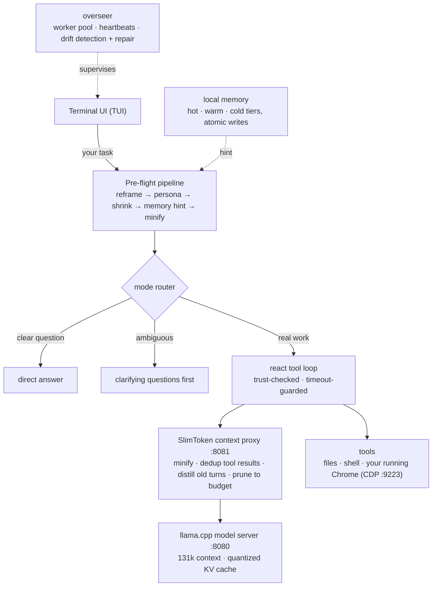
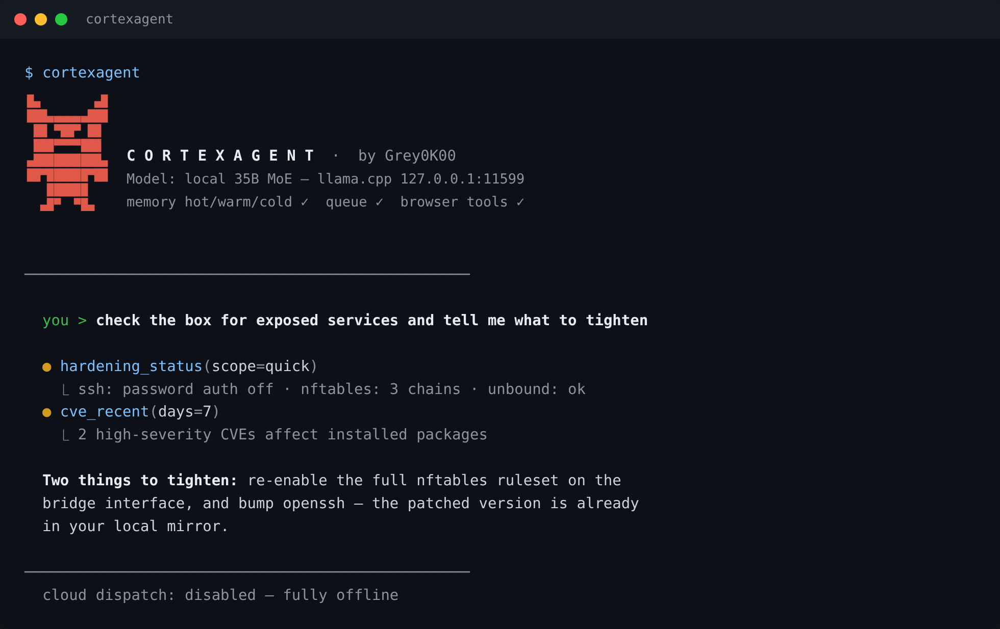

# CortexAgent

> **Your private, local AI coding agent — no cloud, no API key, nothing uploaded.**

CortexAgent is an AI assistant that runs entirely on **your** computer. It helps you write and fix software, automate repetitive work in your web browser, and answer questions about your own files — all without sending anything to an outside service.

**What that means for you:**

- **Private by design.** Your code, files, and conversations never leave your machine.
- **No monthly fees.** There is no cloud subscription and no API key. It uses a model stored on your own computer.
- **Always yours.** Nothing is monitored, logged remotely, or shared. If the internet goes down, it keeps working.
- **One interface: a terminal.** CortexAgent is a TUI — everything happens in the terminal you already have open. There is no separate console, no second app, no panels to manage.

---

## It verifies itself

CortexAgent ships with its own automated self-check, and a version is only released once that check passes. The check runs through four layers — file integrity, documentation accuracy, an in-process test harness, and a feature-catalog sweep — so the version you install is the version that was tested. You can run it yourself any time:

```bash
bin/verify
```

---

## Install

CortexAgent runs on Linux. An NVIDIA graphics card with roughly 16 GB of memory is recommended for best speed (it works on CPU only, just slower).

```bash
git clone https://github.com/greyok00/cortexagent
cd cortexagent
./install.sh      # sets up configuration and the `cortexagent` command
cortexagent       # first run walks you through starting your local model
```

`install.sh` is safe to re-run — it never overwrites your existing settings.

---

## Start in 60 seconds

**Code with it.** Open the assistant and give it a task:

```bash
cortexagent
# → "add a --dry-run flag to bin/publish and test it"
```

**One shot, no session:**

```bash
cortexagent -p "find why the daemon is unresponsive and fix it"
```

**Automate your browser.** Point it at your running Chrome and just ask — to fetch a page, fill in a form, or collect data. It uses ten generic, site-neutral commands (`chrome_status`, `chrome_tabs`, `chrome_navigate`, `chrome_fetch`, `chrome_click`, `chrome_type`, `chrome_evaluate`, `chrome_snapshot`, `chrome_fill_send`, `chrome_health`) and never restarts the browser or closes your tabs.

**Or dictate.** A mouse-only speech-to-text popup lets you talk instead of type. Your audio never leaves the machine.

---

## How it works

When you type a task, it moves through five layers before an answer comes back. Each layer does one job, and each exists because the naive stack — a model server with an agent loop bolted on — hits the same wall at exactly that point.

**1. The model.** The brain is a llama.cpp server bound to `127.0.0.1:8080`. The settings that make or break a long session — context size, KV-cache quantization, layer offload — are pinned and *locked*: the agent verifies them at startup and refuses to drift from them. A quantized KV cache plus offload is what lets a 131,072-token context window fit on a ~16 GB graphics card.

**2. The context proxy.** Every request passes through a compression layer (SlimToken) on `127.0.0.1:8081` before the model sees it. It minifies tool definitions and system text, deduplicates repeated tool results, distills old turns into short summaries, and prunes everything to a token budget — counted with a real tokenizer, not estimated. Without this layer a long session either hits the context wall or you trim it by hand; here the wall is managed automatically, on every request.

**3. The pre-flight pipeline.** Your prompt is framed before the model reads it: reframed into a goal, matched to a persona, shrunk if oversized, given a memory hint, and minified. A mode router then classifies the task and picks the right shape of answer — *direct* for a clear question, *socratic* for an ambiguous one (you get clarifying questions instead of a confident guess), or *react* for real work: a tool loop with at most 16 tools in scope, trust-checked outputs, and timeout-guarded execution.

**4. The hands.** Tools cover your files, your shell, and your browser. The browser integration talks to Chrome you are already running, over its debug protocol, using those ten generic site-neutral commands — it never restarts the browser and never closes your tabs.

**5. The supervisor.** A background overseer coordinates the long-running pieces: a worker pool with heartbeats, per-task progress published as visible steps, and drift detection with self-repair — if configuration has silently changed, it finds it and fixes it.

Underneath all of it sits a local memory store — hot, warm, and cold tiers with atomic writes — so what you told it last week resurfaces when it matters this week. Nothing in it ever leaves your machine.



| Component | Address | Role |
|---|---|---|
| Model | `127.0.0.1:8080` | the assistant's "brain" — a large language model stored locally |
| Context proxy | `127.0.0.1:8081` | compresses every request so more fits at once |
| Browser (Chrome) | `127.0.0.1:9223` | the browser session the assistant can read and control |

Every component binds to `127.0.0.1` — the loopback address used only by your own machine — and is never exposed to the wider network.

> 🔒 **Local only.** These addresses work only on your computer. Do not forward or expose them to the network.

---

## How it compares

CortexAgent didn't start as an agent at all. It started as a session bridge — one unified session kept open across different coding agents (Codex, Claude) instead of juggling separate ones. The bridge became a Claude wrapper, and when the wrapper's limits were hit, the core was replaced with **[pi.dev](https://github.com/badlogic/pi-mono)**, Mario Zechner's deliberately minimal coding agent — a bare model-and-tools loop you extend yourself. That minimalism is a real design position, and pi.dev's ancestry is visible in CortexAgent's core: the same small tool-loop shape, the same refusal to hide what the model is doing. But CortexAgent grew in the opposite direction. Instead of leaving the hard parts as exercises (packages you write for memory, compaction, supervision), it builds them in — and then verifies them at startup, every session.

[Claude Code](https://claude.com/product/claude-code) is the strongest known implementation of this category, and the comparison against it is honest: it runs frontier models that no local GPU can match. But it is a cloud product — your code and context are sent to Anthropic's servers, billed per token, and unavailable offline. CortexAgent's bet is different: the loop doesn't need to be cloud-brained, but the *infrastructure around the loop* — compression, memory, supervision, self-verification — should be shipped, not improvised.

| | Claude Code (cloud) | pi.dev (minimal fork origin) | CortexAgent (local) |
|---|---|---|---|
| Model | Claude models, Anthropic's cloud | Any provider, incl. local | llama.cpp on your own GPU |
| Where your code goes | Anthropic's servers, per token | Depends on the provider you pick | Nowhere. No API key, no upload |
| Offline | No | Yes, with a local model | Yes |
| Context pressure | Automatic cloud-side compaction | Truncation | SlimToken proxy compresses **every request** — minify, dedup tool results, distill old turns, tokenizer-counted budget |
| Memory between sessions | `CLAUDE.md` files, maintained by hand | Bring-your-own | Hot/warm/cold tiers with atomic writes, resurfaced automatically |
| Ambiguous request | The model guesses | The model guesses | Socratic mode: clarifying questions before tools run |
| Long-running work | The agent process | The agent process | Overseer: worker pool, heartbeats, published task progress |
| Config integrity | Anthropic's settings files | Env vars, trusted blindly | Expensive settings **locked** at startup; `doctor` detects and repairs drift |
| VRAM governance | n/a (cloud) | n/a | Voice model gated on free VRAM; big model unloads when idle, returns on demand |
| Browser control | Bundled browser tools | You wire it up | Drives the Chrome you already run over CDP — ten site-neutral commands, never restarts it, never closes your tabs |
| Voice input | Cloud dictation | None | faster-whisper on your GPU, audio never leaves the machine |
| Release quality | Anthropic's CI | None | `bin/verify` — four-layer self-check gates every version |

**What the layers buy you in practice:** sessions that run long without falling off a context cliff, an assistant that remembers last week, ambiguous requests that surface their assumptions before spending your tokens, and settings that fail loudly instead of drifting quietly — with the trade-off stated plainly: a local model will sometimes be out-thought by a frontier one, and that is the price of everything staying on your machine.

---

## Built on

CortexAgent stands on tools other people built. Thanks and credit to the original authors:

- **[llama.cpp](https://github.com/ggml-org/llama.cpp)** by Georgi Gerganov and the ggml team — the model server that does the actual thinking.
- **[Patchright](https://github.com/Kaliiiiiiiiii-Vinyzu/patchright)** by Vinyzu and Kaliiiiiiiiii — a stealth-patched Playwright used for hardened browser automation, alongside the raw [Chrome DevTools Protocol](https://chromedevtools.github.io/devtools-protocol/).
- **[faster-whisper](https://github.com/SYSTRAN/faster-whisper)** by SYSTRAN — speech-to-text, built on [Whisper](https://github.com/openai/whisper) by OpenAI and [CTranslate2](https://github.com/OpenNMT/CTranslate2) by the OpenNMT team.
- **[PyTorch](https://pytorch.org)** — the image/video enhancement backend.
- **[orjson](https://github.com/ijl/orjson)** by Jim Crist-Harif, **[xxHash](https://github.com/Cyan4973/xxHash)** by Yann Collet, and **[tiktoken](https://github.com/openai/tiktoken)** by OpenAI — the fast JSON, hashing, and real-tokenizer layers inside SlimToken.
- **[pi.dev](https://github.com/badlogic/pi-mono)** by Mario Zechner — the fork origin, and the cleanest argument for a minimal harness.

The compression proxy itself, **[SlimToken](https://github.com/greyok00/slimtoken)** (MIT), is CortexAgent's sibling project — a standalone token-optimization and memory layer usable with any LLM stack, not just this one.

---

## About the codebase

The source is deliberately dense. Most modules are written minified — tight one-line statements, no comments, no docstrings — because the *behavior* is the artifact: `bin/verify`'s four layers (file integrity, documentation accuracy, a smoke-test harness, a feature-catalog sweep) check what the code does, not what the comments claim. If a check fails, the release fails.

The hot paths are compiled. SlimToken's build compiles its minify-pipeline compute modules to native libraries with **Cython**; a compiled module shadows its Python sibling and the import resolves to the native build automatically. If Cython or a compiler isn't available, the build skips gracefully and the pure-Python source takes over — nothing breaks either way. Token math inside the pipeline is real (`tiktoken`), not estimated, which is what makes the pruning-to-budget guarantee mean anything.

---

## Features

- **A single terminal assistant.** Everything happens in one TUI — type a task, watch it work, and read what it changed.
- **Remembers between sessions.** Past work is saved locally and resurfaces when it matters, so you don't re-explain yourself.
- **Fits more in one conversation.** Requests are compressed automatically, so more context stays available without you having to trim it.
- **Built-in scheduling.** A background overseer plans and sequences work on your behalf.
- **Frees up resources when idle.** Release the model's memory in one command to make room for other tools, then bring it back.
- **Self-repair.** A built-in diagnostic detects and fixes configuration drift.

### The command line



Everything runs in a single terminal session. Type a task, watch the assistant work through your files and browser, and read what it changes — no window-switching, no separate panels.

---

## When it's not for you

A tool that tests itself should be honest about its limits:

- **Not a frontier research system.** The local model is fast and capable, but for a genuinely novel, never-before-seen puzzle a hosted model is sometimes stronger. Nothing here stops you from exporting the conversation and running it elsewhere.
- **It wants memory.** The recommended setup needs a graphics card with roughly 16 GB. Raising the model's context window beyond the shipped defaults can run out of memory — the shipped settings are the ones that were tested.
- **Text-first.** The assistant works with text — it writes and fixes code, reads your files, and drives your browser — but it doesn't interpret images itself.
- **Single user, Linux only.** One assistant on one machine — not a multi-user team platform.

---

## Command line

```bash
cortexagent                     # interactive session
cortexagent -p "task"           # one-shot task
cortexagent daemon start        # persistent backend
cortexagent models status       # model / context state
cortexagent models unload big   # free memory for other work
cortexagent models load big     # bring the model back
cortexagent doctor              # detect + fix config drift
cortexagent status              # is everything up?
```

---

## Security

- **Local only.** All components bind to `127.0.0.1` and are verified never to expose a network port.
- **No data leaves your machine.** No API keys are stored, no telemetry is collected, and nothing is uploaded. The only network activity in the whole system is yours, if you ever choose to connect to a hosted provider.
- **Local-first by construction.** Your memory, browser state, and voice all live on your computer.

---

## License

MIT — see [LICENSE](LICENSE).