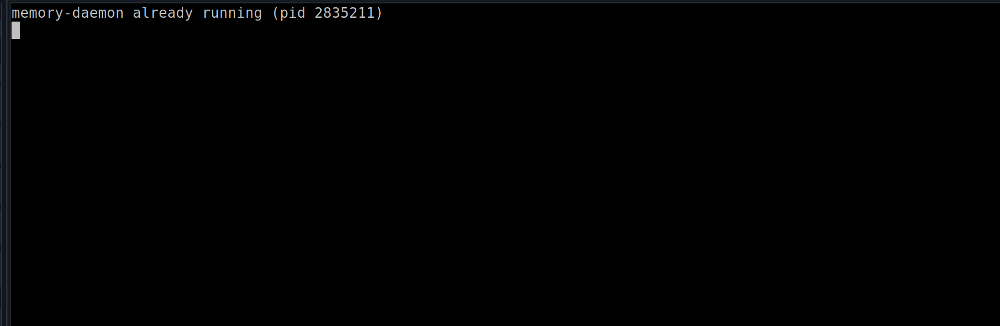

# CortexAgent

> **Your private, local AI coding agent — no cloud, no API key.**

CortexAgent runs entirely on your machine: a local llama.cpp model, a terminal TUI plus a floating Console, automatic memory across sessions, local browser automation, local speech-to-text, and token compression. Everything binds to `127.0.0.1`. No accounts, no telemetry, nothing is ever uploaded.

---

## It verifies itself

`bin/verify` is a four-layer, offline gate that ships with the repo. A release only ships when it passes — and you can run it yourself any time:

| Layer | Check | Last run |
|---|---|---|
| 1 · Manifest | file-hash drift across **1,537 files** | ✅ no drift |
| 2 · Contract | doc-vs-code contract | ✅ |
| 3 · Smoke | in-process smoke harness (no live endpoints) | ✅ |
| 4 · Features | **84** feature-catalog reachability checks | ✅ ALL GREEN |

```bash
bin/verify
```

---

## Install

Linux. An NVIDIA GPU with ~16 GB VRAM is recommended (CPU-only works, slower).

```bash
git clone https://github.com/greyok00/cortexagent
cd cortexagent
./install.sh     # config, memory dirs, systemd units, the `cortexagent` command
cortexagent      # first run prompts you to start your local model
```

`install.sh` is re-runnable and non-destructive — existing config is backed up, never silently overwritten.

---

## Start in 60 seconds

**Code with it** — open the TUI and give it a task:

```bash
cortexagent
# → "add a --dry-run flag to bin/publish and test it"
```

**One-shot, no session:**

```bash
cortexagent -p "find why the daemon is unresponsive and fix it"
```

**Drive the browser** — start Brave with `--remote-debugging-port=9222`, then just ask. The agent has 10 site-agnostic CDP tools (`brave_status`, `brave_tabs`, `brave_navigate`, `brave_fetch`, `brave_click`, `brave_type`, `brave_evaluate`, `brave_snapshot`, `brave_fill_send`, `brave_health`) — it never restarts the browser, never touches the CDP port, never closes your tabs.

**Or dictate** — a mouse-only speech-to-text popup (Start/Stop + Enter). Audio never leaves the machine.

---

## Features

- **Terminal TUI + floating Console** — chat TUI plus a tray-launched window showing the chat stream, the active task, and your open browser tabs.

### The Console



A floating Tkinter window launched from the tray. Three panels: chat (where the agent streams its work), a tab list of the browser pages you're actively using, and the running tasks. The Console is what you watch while the agent works — start a task, switch away, glance back to see progress, jump in when you need to.
- **Local model by default** — Qwen3.6-35B MoE on llama.cpp at `127.0.0.1:8080`. No account, no key, no cloud.
- **Automatic memory** — hot/warm/cold tiers on local disk; sessions resume without re-explaining yourself.
- **Token compression** — a SlimToken proxy at `127.0.0.1:8081` minifies context before the model sees it, so more fits the window.
- **Overseer routing** — a tiny dedicated model (~1.6 GB at `127.0.0.1:8082`) plans, routes, and schedules.
- **Local speech-to-text** — mouse-only dictation popup; audio stays on your machine.
- **Instant VRAM release** — `cortexagent models unload big` frees ~13 GB for games and other tools; `models load big` brings it back.
- **Self-repair** — `cortexagent doctor` detects and fixes config drift.

---

## When it's not for you

A tool that tests itself should name its own limits:

- **Frontier reasoning.** A 13.7 GB local MoE is capable but not frontier-class. For a genuinely novel puzzle you'll often do better with a hosted model — and nothing here stops you from exporting a conversation and running it there.
- **It wants VRAM.** The shipped fit (128k context, default batch) is verified to fit ~16 GB. Raising context or batch beyond the documented defaults OOMs — if you change the fit, test it yourself.
- **Text-first.** The main model is text-only; images route through the bundled vision model (`qwen3-vl`). Vision works, the text model just never sees a pixel.
- **Single-user, Linux-only.** One agent on one machine — not a multi-user team platform.

---

## How it works

| Service | Address | Role |
|---|---|---|
| Big model (llama.cpp) | `127.0.0.1:8080` | the agent's brain — Qwen3.6-35B MoE, 128k ctx |
| SlimToken proxy | `127.0.0.1:8081` | OpenAI-compatible frontend; minifies context before the model |
| Overseer | `127.0.0.1:8082` | tiny model — plans, routes, schedules |
| CDP (Brave) | `127.0.0.1:9222` | page-level browser automation |

Everything binds to `127.0.0.1` — never `0.0.0.0`. Enforced in code, checked by `bin/verify`. A systemd user daemon owns the big-model + proxy lifecycle and idle-unloads the model to free VRAM.

> 💡 **VRAM:** `cortexagent models unload big` drops the model instantly; `cortexagent models load big` brings it back.
> ⚠️ **Model fit:** raising context or batch beyond the shipped defaults OOMs on 16 GB — the shipped fit is the one that was verified.
> 🔒 **Localhost:** these ports are local-only by design — don't forward or expose them.

---

## CLI

```bash
cortexagent                      # interactive session (TUI + tray)
cortexagent -p "task"            # one-shot
cortexagent daemon start         # persistent backend
cortexagent models status        # big / tiny / proxy state
cortexagent models unload big    # free ~13 GB VRAM
cortexagent doctor               # detect + fix config drift
cortexagent status               # is everything up?
```

---

## Security

- **Binds `127.0.0.1` only** — enforced in code, verified by `bin/verify`.
- **No API keys stored, no telemetry, nothing uploaded.** The only network call in the whole system is yours — when you opt in to a hosted provider.
- **Local-first by construction** — memory, browser state, and voice all live on your machine.

---

## License

MIT — see [LICENSE](LICENSE).
