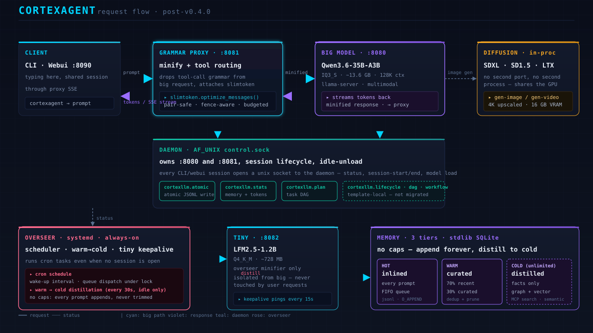

# CortexAgent

**A local-first coding agent that runs entirely on your hardware.** One daemon,
one always-on overseer, one big model on `:8080`, one tiny LLM on `:8082` for
the overseer's minifier, in-process `diffusers` for image and video. No cloud,
no API key, no telemetry, no fallback swap path — the big model **is** the
agent, and if it can't load, `:8080` goes down.

You talk to it through the CLI, the tray popout, or the 3D webui on `:8090`.
All three share the same session through the proxy.

> Maintained by [GreyOK00](https://github.com/greyok00).

## Why you'd want it

| Reason | What it means for you |
|---|---|
| **No API bills, no rate limits, no rate-limit reroutes** | The 35B MoE runs on your GPU. Prompt as fast as you can think. |
| **Your code never leaves the box** | Repo, memory, conversation, and embeddings all live under `~/.cortexagent/`. Airgap-friendly. |
| **Two systemd services that survive logout** | `cortexagent.service` (daemon + big model) and `cortexagent-overseer.service` (scheduler + tiny keepalive) start on login. Close the CLI — they keep running. |
| **Three memory tiers with no caps** | Every prompt appends to HOT and mirrors to WARM forever. The overseer distills facts into COLD (unlimited) every 30 s, only when idle. You don't lose context to a window or a tokenizer. |
| **Grammar proxy as a chokepoint** | Every chat request flows through `:8081`, which strips tool-call grammars and minifies the prompt via `slimtoken` before it reaches the big model. You save VRAM, you save latency, you don't break tool calls. |
| **In-process diffusion** | SDXL / SD1.5 / LTX-Video on the same GPU, no second port, no second process. Ask for `gen-image` and `gen-video` from the same prompt. |
| **Drop-in core, not a fork** | CortexAgent consumes `cortexllm` and `slimtoken` as real packages. Local-only changes are adapters, not duplicates. We side-port; we don't fragment. |

## Stack at a glance

| Component | Port | Process | Purpose |
|---|---|---|---|
| Big LLM | `:8080` | `llama-server` | Qwen3.6-35B-A3B IQ3_S (~13.6 GB, 128K context) |
| Tiny LLM | `:8082` | `llama-server` | LFM2.5-1.2B Q4_K_M (~728 MB) — overseer minifier only |
| Grammar proxy | `:8081` | `lib/grammar_proxy.py` | Minify + tool-call routing for every chat request |
| Daemon | AF_UNIX `~/.cortexagent/control.sock` | `lib/daemon.py run` | Owns `:8080` / `:8081`, session lifecycle, idle-unload |
| Overseer | always-on systemd service | `lib/overseer.py start` | Scheduler, warm→cold distillation, tiny keepalive |
| Webui | `:8090` | `lib/webui.py serve` | 3D chat + live dashboard, shared session with CLI |
| Diffusion | in-process | `lib/diffusion_backend.py` | SDXL / SD1.5 image, LTX-Video (group-offloaded) |

Two systemd user services run the whole stack independent of any CLI session:

- `cortexagent.service` — daemon + proxy + big-model slot
- `cortexagent-overseer.service` — overseer + tiny keepalive

## How it works



**A prompt flow:**

1. You type in the CLI, the tray, or the webui. All three share the same session.
2. Every request hits the grammar proxy on `:8081`. The proxy:
   - Strips `grammar` fields that llama-server rejects on the chunked transport.
   - Calls `slimtoken.optimize_messages()` to minify the prompt pair-safely (system prompt and tools are not touched; only the conversation is compressed).
   - Attaches a `<cold_memory>` block distilled from COLD.
3. The minified request goes to the big model on `:8080`. Tokens stream back as SSE.
4. The proxy re-emits the stream to the client. The SessionBridge atomically appends the turn to `~/.cortexagent/state/webui_session.jsonl` (O_APPEND + flock, never clobbers).

**Out of band, the overseer:**

- Pings the tiny model on `:8082` every 15 s so it stays warm.
- Every 30 s, when the system is idle, runs warm→cold distillation — pulls recent warm entries, asks the tiny model to extract facts, writes them to cold SQLite.
- Runs scheduled cron tasks even when no CLI session is open.

**The daemon:**

- Owns `:8080` and `:8081`. If the big model can't load, the daemon exits and the systemd unit shows failed status — there is no fallback swap path, by design.
- Tracks session lifecycle (start, end, idle timer) and exposes them over the AF_UNIX control socket for the tray and webui to display.

## Install

```bash
git clone https://github.com/greyok00/cortexagent ~/cortexagent
cd ~/cortexagent
bash install.sh        # installs the two systemd services + creates ~/.cortexagent/
```

Drop a GGUF at the default path, or override:

```bash
export CORTEXAGENT_MODEL="$HOME/models/your-model.gguf"
```

`cortexagent.conf` (`~/.cortexagent/cortexagent.conf`) accepts the same keys in
`[backend]` and `[daemon]` sections.

## Run

```bash
cortexagent                     # interactive CLI (default — talks to the daemon)
cortexagent -p "fix this bug"   # one-shot
cortexagent --restart           # restart both services, reload big
cortexagent doctor              # repair drift, validate config
cortexagent status              # print daemon / overseer / proxy state
```

Open `http://127.0.0.1:8090/` for the webui. CLI and webui share the same
session through the proxy — typing in either window sees the same context.

## Configuration

| Key (`cortexagent.conf [backend]`) | Env | Default | Notes |
|---|---|---|---|
| `big_model` | `CORTEXAGENT_MODEL` | `~/models/qwen3.6-35b-iq3s/Qwen3.6-35B-A3B-UD-IQ3_S.gguf` | Big GGUF |
| `big_model_port` | `CORTEXAGENT_PORT` | `8080` | |
| `big_ctx` | `CORTEXAGENT_CTX` | `131072` | 128K — KV q4_0 ≈ 640 MB |
| `big_alias` | `CORTEXAGENT_ALIAS` | `cortexagent` | OpenAI `model` field |
| `tiny_model` | `CORTEXAGENT_TINY_MODEL` | `~/models/lfm2.5-1.2b/LFM2.5-1.2B-Instruct-Q4_K_M.gguf` | Overseer only |
| `tiny_model_port` | `CORTEXAGENT_TINY_PORT` | `8082` | **Isolate in tests** — see CLAUDE.md |

| Key (`[daemon]`) | Default | Meaning |
|---|---|---|
| `idle_unload_sec` | `0` | 0 = keep big loaded always. >0 = unload big N seconds after the last session ends. |

Diffusion env (optional): `CORTEXAGENT_VIDEO_MODEL`, `CORTEXAGENT_UPSCALER`
(`lanczos` \| `realesrgan`), `CORTEXAGENT_DIFFUSION_CUDNN` (default `0` — see
`lib/diffusion_backend.py` for why).

## Memory (three tiers, stdlib SQLite)

| Tier | Cap | What |
|---|---|---|
| Hot | 300 entries (FIFO) | Inlined into every prompt |
| Warm | 2000 entries (70% recent + 30% curated) | Dedup + prune on save |
| Cold | **unlimited** | Distilled facts the overseer extracts from warm |

The overseer distills warm→cold every 30 s and only kicks in when the system
is otherwise idle. There is no rotation cap on hot or warm — every prompt
appends forever. The COLD tier is the place where context outlives the
session.

## Diffusion

In-process `diffusers`, no second port, no second process. The big LLM stays
loaded the whole time; diffusion runs on the same CUDA device with its own
VRAM budget.

- **Image:** SDXL preferred (best 4K quality), SD1.5 fallback
- **Video:** LTX-Video, group-offloaded to fit 16 GB
- **4K output:** generated at model-native res, upscaled to 3840×2160 with
  LANCZOS4 (or Real-ESRGAN if installed)
- **cuDNN:** disabled by default (`CORTEXAGENT_DIFFUSION_CUDNN=0`) — the
  shipped NVIDIA driver raises `CUDNN_STATUS_NOT_INITIALIZED` for SD 1.5

```bash
python3 lib/diffusion_backend.py gen-image "a cat in a hat" --output cat.png
python3 lib/diffusion_backend.py gen-video "a dog running"   --output dog.mp4
```

## CortexAgent features

| Area | Feature | Where |
|---|---|---|
| **Agent** | One big model, no fallback swap | `lib/daemon.py _start_big` |
| **Agent** | Idle-unload big model (opt-in, default off) | `[daemon] idle_unload_sec` |
| **Agent** | Hot-swap model file at runtime | `lib/daemon.py swap` |
| **Agent** | Adopted-model guard (no orphan llama-server) | `lib/daemon.py` |
| **Proxy** | Strip `grammar` field on chunked transport | `lib/grammar_proxy.py` |
| **Proxy** | `slimtoken.optimize_messages()` on every chat | `lib/grammar_proxy.py` |
| **Proxy** | Real `/metrics` (tok/s source of truth) | `lib/grammar_proxy.py` |
| **Proxy** | Reload-aware (picks up new big model without restart) | `lib/grammar_proxy.py` |
| **Overseer** | Always-on systemd service | `cortexagent-overseer.service` |
| **Overseer** | Tiny keepalive (15 s pings on `:8082`) | `lib/overseer.py` |
| **Overseer** | Warm→cold distillation (30 s, idle-only) | `lib/overseer.py` |
| **Overseer** | Cron schedule + plan/workflow tracking | `lib/overseer.py` |
| **Overseer** | Clean SIGPIPE-safe exit 0 | `lib/overseer.py` |
| **Webui** | 3D chat surface on `:8090` | `lib/webui.py` |
| **Webui** | Shared session with CLI via SessionBridge | `lib/session_bridge.py` |
| **Webui** | SSE event stream `/webui-events` | `lib/webui.py` |
| **Webui** | Live overseer + tray dashboard widgets | `lib/webui.py` |
| **Tray** | Wolf-head system-tray icon | `lib/tray.py` |
| **Tray** | Popout overseer dashboard | `lib/tray_dashboard.py` |
| **Tray** | Linked to overseer (Wants= + PartOf=) | `cortexagent-tray.service` |
| **CLI** | Plain mode by default (R1) | `bin/cortexagent` |
| **CLI** | Code hidden unless `with code` (R2) | `lib/statusline.py` |
| **CLI** | `_` divider + `▎ thinking:` line after every response (R3) | `lib/banner.py` |
| **CLI** | Response minify via grammar proxy (R4) | `lib/grammar_proxy.py` |
| **CLI** | Box-drawn tables, `█` numerics, `▎` lists (R5) | `lib/visual.py` |
| **CLI** | Clarifying question on ambiguous prompts (R6) | `engine/cli.py` |
| **CLI** | Big is multimodal (R7) | `lib/grammar_proxy.py` |
| **Memory** | Atomic append-only JSONL (O_APPEND + flock) | `lib/session_bridge.py` |
| **Memory** | Username field for multi-voice identity | `lib/session_bridge.py` |
| **Memory** | Hot/Warm write-through (no caps, no rotation) | `lib/cortexagent_call.py` |
| **Diffusion** | SDXL / SD1.5 in-process | `lib/diffusion_backend.py` |
| **Diffusion** | LTX-Video group-offloaded | `lib/diffusion_backend.py` |
| **Diffusion** | 4K upscale (LANCZOS4 or Real-ESRGAN) | `lib/diffusion_backend.py` |
| **Doctor** | `cortexagent doctor` repairs settings drift | `engine/cli.py` |
| **Smoke** | 29-test gate before commit | `tests/run_smoke.py` |

## cortexllm — what ships standalone vs. what CortexAgent uses

CortexLLM is the upstream memory/atomic/stats library: a stdlib-only,
pip-installable package (`pip install cortexllm`) with nine modules and five
MCP tools. It's the library; CortexAgent is one of its consumers.

| Module | Standalone role | How CortexAgent uses it |
|---|---|---|
| `cortexllm.atomic` | Atomic JSONL write (O_APPEND + flock + fsync) | `lib/session_bridge.py` uses it for every turn append — no two CLI/webui writers can clobber each other |
| `cortexllm.stats` | Memory + token counters | `lib/tray_dashboard.py` polls it to draw the live memory bars in the tray popout and the webui |
| `cortexllm.plan` | Task DAG with conflict detection | `lib/overseer.py` runs the scheduler through it — cron tasks become plan nodes with dependencies |
| `cortexllm.lifecycle` | Session lifecycle hooks | Template-local (not yet migrated) |
| `cortexllm.dag` | DAG executor | Template-local (not yet migrated) |
| `cortexllm.workflow` | Workflow template renderer | Template-local (not yet migrated) |
| `cortexllm.drain` | Backpressure-aware queue drain | Used by the prompt queue when the big model is slow |
| `cortexllm.scheduler` | Cron + interval scheduler | Overseer cron |
| `cortexllm.integrity` | WAL + checksum chain | SessionBridge verifies turns on read |

The drop-in pattern is an **adapter, not a fork** — `lib/cortexllm_adapter.py`
imports the package, falls back to the in-tree implementation if it's older
than v0.4.0, and pins the surface area. Local changes side-port back.

## slimtoken — what ships standalone vs. what CortexAgent uses

Slimtoken is the upstream token minifier (MIT, `pip install slimtoken`). It
ships an MCP server, an async proxy, an Agent Skill, and a CLI. CortexAgent
uses it as a **hard runtime dependency** — the grammar proxy imports it
directly.

| Capability | Standalone | In CortexAgent |
|---|---|---|
| **Pair-safe pruning** | Drops leading messages, never splits a system/tool pair | Same — applied to every chat request on `:8081` |
| **Fence-aware** | Won't break ```code fences```, JSON braces, or quoted strings | Same |
| **Budgeted** | Hard cap on input tokens, configurable | Set to `big_ctx * 0.85` per request (128K model → ~111K effective budget) |
| **Tool-result compression** | Detects directory listings / git output / logs / JSON / source | Same — runs in the proxy after every tool turn |
| **Anthropic / OpenAI / Ollama** | All three formats, normalized to canonical | Proxy uses OpenAI format (llama-server's `/v1/chat/completions`) |
| **High-context VRAM presets** | Dense + MoE presets for 4 / 8 / 16 GB tiers | Inherited via `SLIMTOKEN_*` env knobs (one always-on config) |
| **Async proxy** | Standalone `slimtoken-proxy` on any port | **Built into `:8081`** — the grammar proxy is a slimtoken-aware async proxy |
| **MCP server** | 8 tools (`optimize_messages`, `inspect_budget`, etc.) | Same — exposed via `mcp__slimtoken__*` for any Claude Code session |
| **CLI** | `python3 -m slimtoken` | Available but the proxy path is preferred (chokepoint guarantee) |

The key difference: **standalone slimtoken is a tool you reach for when a
prompt is too big**. **In CortexAgent it is the chokepoint that keeps every
prompt from getting too big in the first place.**

## CLI rules (R1–R7)

The CLI runs in plain mode by default. The dashboard lives in the webui, not
in a TUI panel.

| | |
|---|---|
| R1 | Plain CLI; the dashboard is the 8090 webui. |
| R2 | Code hidden by default. Say `show code` or `with code` to reveal. |
| R3 | After every response: `_` divider + `▎ thinking: …` line. |
| R4 | Output-side minify via `lib/grammar_proxy.minify_response()`. |
| R5 | Visual output always on — tables → box-drawn, numeric → `█`, lists → `▎`. |
| R6 | Ambiguous prompts trigger a clarifying question instead of being routed. |
| R7 | Big stays loaded (`idle_unload_sec=0`). Big is multimodal. |

## What's intentionally NOT here

- **No fallback model.** If the big GGUF can't load, `:8080` goes down.
  Re-add a fallback path by reverting `lib/daemon.py` `_start_big`.
- **No separate flux/LTX GGUF into the LLM slot.** Diffusers is the only
  diffusion path; llama-server can't host SDXL/LTX (unknown architecture).
- **No openclaw integration.** Was an experimental module; removed.
- **No remote `/api/chat` auth beyond `CORTEXAGENT_WEBUI_TOKEN`.** Localhost only.

## Project layout

```
cortexagent/
├── bin/cortexagent                 # CLI launcher
├── engine/cli.py                   # argparse → daemon control socket
├── lib/
│   ├── daemon.py                   # owns :8080/:8081 + AF_UNIX sock
│   ├── overseer.py                 # scheduler + tiny keepalive
│   ├── grammar_proxy.py            # :8081 chokepoint (minify + tool routing)
│   ├── model_backend.py            # llama-server wrapper
│   ├── diffusion_backend.py        # in-process SDXL/SD1.5/LTX
│   ├── tiny_llm.py                 # LFM2.5-1.2B client
│   ├── prompt_queue.py             # decompose/conflict/supersede
│   ├── webui.py                    # :8090 server
│   ├── tray_dashboard.py           # tray popout overseer view
│   ├── statusline.py               # brand bar (CLI bottom)
│   └── ...
├── assets/workflow.svg             # architecture diagram
├── assets/cortexagent.jpg          # brand reference
├── config/templates/*.service      # systemd unit templates
├── install.sh
└── tests/run_smoke.py              # gate (29/29 must pass before commit)
```

## Dependencies

The core is stdlib-only Python.

- **Required:** `llama-server` (llama.cpp build), the GGUF you want to serve,
  an NVIDIA GPU with enough VRAM for the model (defaults tuned for 16 GB).
- **Optional:** `claude` CLI (for interactive mode), Brave/Chrome (browser
  tools), `diffusers` + `torch` (image/video — only needed if you call
  diffusion endpoints).
- **Packages:** `cortexllm>=0.4.0`, `slimtoken>=0.3.3`, `orjson`, `xxhash`.

## See also

- [ABOUT.md](ABOUT.md) — short pitch, screenshots, "is this for me?"
- [docs/ARCHITECTURE.md](docs/ARCHITECTURE.md) — full system architecture
- [docs/CORTEXLLM-0.4.0-DIVERGENCE.md](docs/CORTEXLLM-0.4.0-DIVERGENCE.md) —
  why CortexAgent uses cortexllm as a package, not a fork
- [docs/SEPARATION.md](docs/SEPARATION.md) — what's in the package vs. what's
  in the adapter
- [docs/AUDIT-2026-08-11.md](docs/AUDIT-2026-08-11.md) — last full audit

## License

MIT — see [LICENSE](LICENSE). Maintained by GreyOK00.