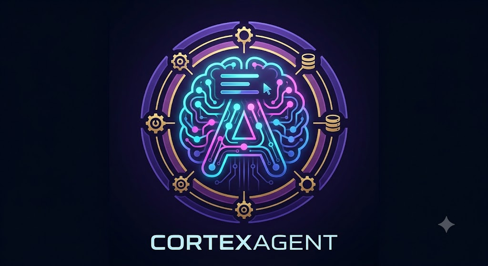
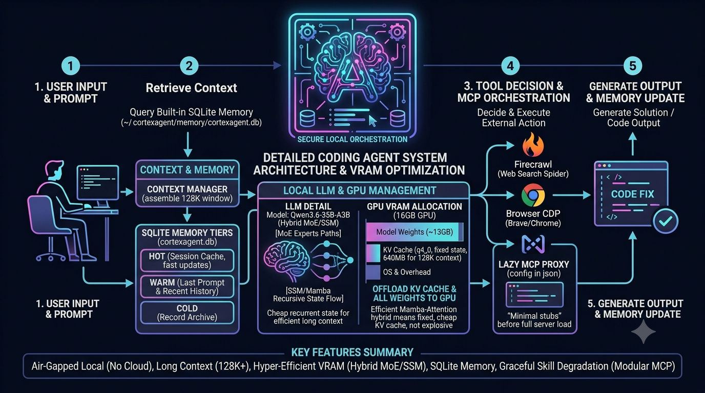

# CortexAgent

<p align="center">
  
</p>

A local coding agent by **GreyOK00**. Runs entirely on a local [llama.cpp](https://github.com/ggml-org/llama.cpp) model — no cloud, no API key — with built-in SQLite memory, automatic context recovery, optional browser tools, and a minimal MCP footprint.

## What it does

- **Local agent.** Model lives in VRAM only for the session; closing frees VRAM.
- **Auto-compact.** `CLAUDE_CODE_MAX_CONTEXT_TOKENS` and `AUTO_COMPACT_WINDOW` are pinned to the llama-server `-c` value so compaction fires correctly.
- **Built-in memory.** Hot/warm/cold tiers are stored in `~/.cortexagent/memory/cortexagent.db` via an in-repo MCP server. No external memory service.
- **Context recovery.** SessionStart injects the last request + recent memory on startup, `/clear`, and auto-compact. The last prompt is replayed after compact.
- **Optional tools.** Firecrawl (lazy, 1-tool) and Brave/Playwright CDP (port 9222) are enabled by default but degrade gracefully if deps are missing.
- **Optional lazy MCP proxy.** Personal servers like `wp-studio` can stay installed without bloating every prompt: list them in `~/.cortexagent/config/lazy_mcp_servers.json` and they only expose a stub until called.

## Why this model and settings

The default model is **Qwen3.6-35B-A3B** (a hybrid SSM/Mamba + attention MoE). It is the sweet spot for a single 16 GB VRAM desktop:

| Component | Default | Why |
|---|---|---|
| Model weights | `Qwen3.6-35B-A3B-UD-IQ3_S.gguf` | ~13 GB in VRAM. Large enough to act as a real coding assistant; small enough to leave headroom for KV cache and OS overhead on a 16 GB GPU. |
| Context window (`-c`) | `131072` (128K) | Fits comfortably with the tiny KV cache of the hybrid architecture. |
| KV cache type (`-ctk/-ctv`) | `q4_0` | ~5 KB per token. At 128K context that is ~640 MB, leaving plenty of room for weights and growth. |
| KV cache offload | enabled | Keeps KV on the GPU with the weights; generation stays fast instead of falling back to system RAM. |
| GPU layers (`-ngl`) | `999` | All weight layers on GPU. |
| Flash attention (`-fa`) | on | Faster attention and lower VRAM/RAM pressure. |
| Auto-compact threshold | 95% of the context window | Compacts only when context is actually full, not every turn. |

### Real-world result

You get a fully local coding agent with a 128K-token working memory that fits in a single consumer 16 GB GPU. The hybrid model’s fixed recurrent state means the KV cache does not explode like a pure attention model, so long context is cheap. Output speed is fast on short-to-medium prompts and remains usable even as context grows because the KV stays on the GPU.

> Token-per-second numbers will be added after a controlled benchmark run.

## Requirements

- llama.cpp build with `bin/llama-server`
- GGUF model (default: Qwen3.6-35B-A3B quant; override with `CORTEXAGENT_MODEL`)
- NVIDIA GPU with ~16 GB VRAM (defaults tuned for that)
- `claude` (Claude Code) CLI on `PATH`
- Optional: Brave/Chrome for browser tools, `npx` + `FIRECRAWL_API_KEY` for Firecrawl
- Optional: Rust toolchain for the Tauri tray app (CLI works without it)

## Install

```bash
git clone <this-repo> ~/cortexagent
cd ~/cortexagent
bash install.sh
```

## CLI usage

```bash
cortexagent                       # interactive
cortexagent -p "fix this bug"     # one-shot
CORTEXAGENT_CTX=65536 cortexagent # smaller window
```

## Configuration (env vars)

| Var | Default | Purpose |
|---|---|---|
| `CORTEXAGENT_MODEL` | path to default Qwen3.6-35B-A3B GGUF | model file |
| `CORTEXAGENT_ALIAS` | `cortexagent` | model alias |
| `CORTEXAGENT_PORT` | `8080` | llama-server port |
| `CORTEXAGENT_PROXY_PORT` | `8081` | grammar-proxy port |
| `CORTEXAGENT_CTX` | `131072` | context window |
| `CORTEXAGENT_NGL` | `999` | GPU layers |
| `CORTEXAGENT_FA` | `on` | flash attention |
| `CORTEXAGENT_CTK` / `CORTEXAGENT_CTV` | `q4_0` | KV cache type |
| `CORTEXAGENT_KV_OFFLOAD` | `1` | KV cache on GPU |
| `CORTEXAGENT_LLAMA_DIR` | `$HOME/llama.cpp/build` | llama.cpp build dir |
| `CORTEXAGENT_FIRECRAWL_ENABLED` | `1` | enable lazy firecrawl tool |
| `CORTEXAGENT_BRAVE_ENABLED` | `1` | enable Brave/Playwright tools |
| `CORTEXAGENT_WEBUI_ENABLED` | `1` | enable local web UI |
| `CORTEXAGENT_MEMORY_DIR` | `$HOME/.cortexagent/memory` | SQLite DB + seed files |

## Project layout

```
cortexagent/
├── bin/cortexagent            # launcher + server lifecycle
├── memory/                    # SQLite memory core + MCP server
│   ├── db.py
│   ├── manager.py
│   └── mcp_server.py
├── lib/                       # Python helpers (grammar proxy, MCP wrappers, etc.)
├── config/                    # CLAUDE.md, AGENT.md, settings/templates
├── hooks/                     # SessionStart, UserPromptSubmit, Stop
├── extension/                 # optional Chromium sidebar source
├── tauri/                     # optional Tauri tray source
├── install.sh
└── README.md
```

## Dependencies

The core package is **stdlib-only Python**. Nothing is installed from PyPI.

- **Required externally:** `llama-server` (llama.cpp build), `claude` CLI.
- **Optional:** Brave/Chrome browser, `npx` + Firecrawl API key, Rust toolchain for Tauri.

## Workflow

<p align="center">
  
</p>

## License

MIT — see [LICENSE](LICENSE).
