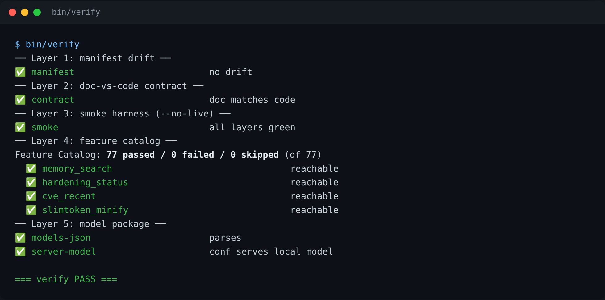
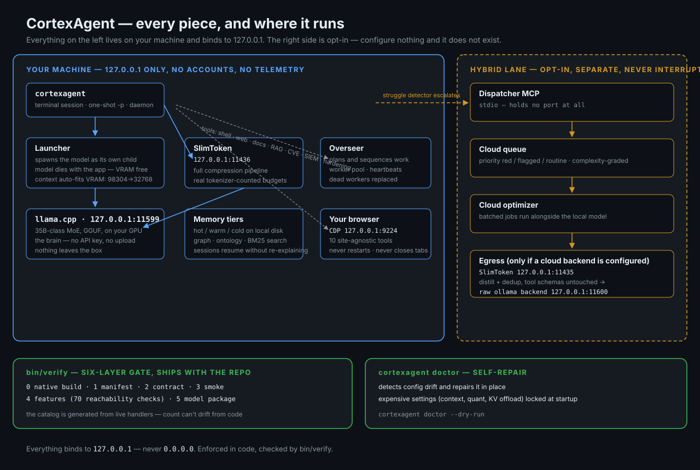
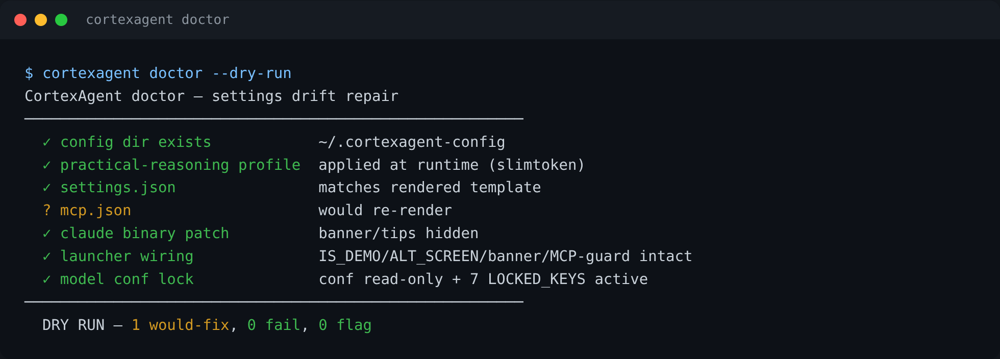

# CortexAgent

> **Your private, local AI coding agent — no cloud required, no API key.**


CortexAgent runs on your machine: a local llama.cpp model spawned and owned by the launcher, a terminal session pinned to it, automatic memory across sessions, local browser automation, and token compression. Everything binds to `127.0.0.1`. No accounts, no telemetry.

Cloud is **optional and separate**: a hybrid lane built around one MCP server — a scheduler + cloud queue that takes work the local loop escalates. Don't configure it and cortexagent is fully offline; nothing cloud exists. See [The hybrid lane](#the-hybrid-lane) and [Security](#security).

---

## It verifies itself

`bin/verify` is an offline gate that ships with the repo — six layers, from native build state to the feature catalog. A release only ships when it passes, and you can run it yourself any time:

```bash
bin/verify
```



| Layer | Check |
|---|---|
| 0 · Native build | compiled Cython modules present and current |
| 1 · Manifest | file-hash drift across the repo |
| 2 · Contract | docstring/doc claims match code |
| 3 · Smoke | in-process smoke harness (no live endpoints) |
| 4 · Features | **70** feature-catalog reachability checks |
| 5 · Model package | models.json + local model conf |

The feature catalog is generated, not maintained: `tools/build_feature_catalog.py` re-derives it from the live handlers, so the count and the checks can't drift from the code.

---

## Install

Linux. An NVIDIA GPU with ~16 GB VRAM is recommended (CPU-only works, slower).

```bash
git clone https://github.com/greyok00/cortexagent
cd cortexagent
./install.sh     # config, memory dirs, systemd units, the `cortexagent` command
cortexagent      # first run starts your local model
```

`install.sh` is re-runnable and non-destructive — existing config is backed up, never silently overwritten.

---

## Start in 60 seconds

**Code with it** — open the session and give it a task:

```bash
cortexagent
# → "add a --dry-run flag to bin/publish and test it"
```

**One-shot, no session:**

```bash
cortexagent -p "find why the daemon is unresponsive and fix it"
```

**Drive the browser** — open two tabs in your debugging window (chromium by default) and pin them. The agent has ten site-agnostic CDP tools — navigate, click, type, snapshot, evaluate and more — it never restarts the browser, never touches the CDP port, never closes your tabs.

**Or let it answer your messages** — it watches one configured thread plus your inbox and replies from your default browser; your logged-in tabs are the credential. OAuth is an optional alternative, never a requirement.

---

## Features — the local half

Everything below works with zero cloud configuration. Every tool name is reachability-checked by `bin/verify` on every run.

### The agent

- **Terminal session pinned to the local model** — give it a task, watch it work, read what it changed.
- **Socratic mode** — an ambiguous request gets clarifying questions before tools run, not a guessed interpretation (`lib/react_loop.py`).
- **Overseer** — a background service that plans and sequences work: a worker pool with heartbeats, dead workers replaced automatically, published task progress.
- **Session awareness** — `session_broadcast` / `session_check` / `session_log` let parallel sessions see what the others are doing.

### The brain and its resources

- **Local model by default** — a 35B-class MoE on llama.cpp at `127.0.0.1:11599`, spawned by the launcher as its own child: context auto-fits your free VRAM (98304 → 73728 → 49152 → 32768 until it fits), and the model dies with the app — VRAM is back the same second.
- **Memory** — hot + cold tiers on local disk (uncapped hot working set, curated cold facts; a legacy `warm` mirror kept for older tooling), with a knowledge graph, ontology ops, and semantic (BM25) search: `memory_read`, `memory_write`, `memory_search`, `memory_clear`, `memory_search_semantic`, `memory_graph_query`, `memory_ontology`. Sessions resume without re-explaining yourself. A thin CLI (`memory_thin` — append/read/search/cold/sessions) plus `cortexagent_call` expose the same memory from scripts.
- **Token compression** — SlimToken minifies requests before the backend sees them: `slimtoken_minify` / `slimtoken_maxify` round-trip markers, a full pipeline on the local lane (`:11436`), tokenizer-counted budgets. More fits the window.
- **Self-repair** — `cortexagent doctor` detects and fixes config drift; see [Self-repair](#self-repair).

### The tool belt

| Group | What's in it |
|---|---|
| **Shell + delegation** | `run_command` (stdout/stderr, timeout-guarded), `query_llm` (overseer reasoning engine), `spawn_subagent` (full-tool-access subagent for parallel work) |
| **Browser** | ten CDP tools driving your own default browser: `chrome_status/tabs/navigate/fetch/click/type/evaluate/snapshot/fill_send/health` — site-agnostic, shadow-DOM aware, never restarts the browser |
| **Web + search** | `web_search` (local SearXNG → Firecrawl → DuckDuckGo fallback), the adapter layer with fan-out (`adapter_search`, `adapter_list` — Google CSE, SearXNG, …), `firecrawl_search` / `firecrawl_scrape` |
| **Documents + RAG** | `parse_document` (PDF/DOCX/PPTX/XLSX/scanned), `ingest_domain` (business/dfir/law/osint/programming), `rag_query`, `coding_practices`; plus the `cortexagent-rag-ingest` helper |
| **Security posture** | live read-only checks: `hardening_status`, `nftables_list`, `auditd_query`, `sshd_config_dump`, `sysctl_current`, `unbound_status`, `capabilities_list`, `lsm_stack` |
| **CVE + MITRE intel** | `cve_recent` (NVD+KEV+EPSS+GHSA+OSV cache), `cve_lookup` with ATT&CK technique mapping, `mitre_techniques_for_cve`, `mitre_mitigations_coverage`, `cve_poll_now`; CLI mirror in `bin/cortexagent-cve` |
| **SIEM + SOAR** | `siem_recent` / `siem_posture` / `siem_push_recent`, playbook runs over recent CVEs and posture fails (`soar_run_on_recent`, `soar_run_posture`), `soar_history`; CLI mirror in `bin/cortexagent-siem` |
| **Downloads** | `download` — parallel range-chunks, resumable (`.part` + HTTP Range), SHA256-verified |
| **Model providers** | `add_llm_provider` — checklist for adding a provider to the core |

### Safety rails

- **Injection guard** — prompt-injection markers detected and audited before they reach the loop.
- **Secret-leak ban** — outbound responses are scanned for API-key shapes (`sk-`, `ghp_`, …) and rejected.
- **Loop guard + pre-flight gates** — repeated failing calls are stopped; tools carry trust levels checked at the call site.
- **Config integrity** — expensive settings (context, quantization, KV offload) are **locked** at startup; `doctor` detects and repairs drift.

### Daemon and control

- **Persistent daemon** with a control socket — `ping`, `status`, `activity`, `run`, `start`, `stop`, `shutdown` — surfaced through `cortexagent status` and the status line.
- **Systemd units** for the daemon, overseer, and family services; `cortexagent --restart` bounces them and waits for health.

---

## Features — the hybrid half

Everything in this section is opt-in. Disable it and none of it exists — the agent is fully offline.

- **Message triage** — one configured thread plus your inbox, answered from your default browser; your logged-in tabs are the credential. Sends are deterministic — scripted payload steps with a post-send landing check, no model call in the loop, so a send can't loop, stall, or invent a recipient.
- **The hybrid lane** — queued, complexity-graded remote work that never interrupts the local model. Explained below, because it's one thing: [one MCP server](#the-hybrid-lane).

---

## The hybrid lane

The hybrid lane is a single piece: an MCP server that owns everything cloud. It's a stdio server — it holds no port at all.

### What it contains

| Tool | What it does |
|---|---|
| `queue_add` | queue a task — `priority: red\|flagged\|routine`, `complicated: true` routes it to cloud grading |
| `queue_next` | claim the next runnable task — refuses while something is already running (the anti-preempt contract) |
| `queue_list` | compact view of queued/running tasks |
| `queue_done` | mark a task done with a one-line result |
| `queue_block` | block a task that failed twice locally; surfaces it to you |
| `optimizer_status` | cloud optimizer state: last batch, latency, errors |

### How the local loop uses it

- **Escalation, not conversation.** When the local model keeps failing at the same call, the loop's struggle detector intervenes: it tells the agent to queue the task to the cloud lane (`complicated=true`, priority `flagged`) and stop repeating the failing call. The local session stays clean; the hard part runs in parallel.
- **Cloud work runs as a separate lane.** Queued jobs are graded for complexity, batched, and executed by the cloud optimizer — alongside the local model, never interrupting it. The two lanes claim work independently, so a busy brain never blocks a queued send.
- **Cloud traffic is minified on the way out.** Every cloud request passes through the local SlimToken cloud lane first (`:11435` — distill + dedup, tool schemas untouched) before reaching the raw backend (`:11600`).
- **With the dispatcher disabled, none of this exists.** No queue, no grading, no cloud calls — the session is pure local.

---

## How it works



| Piece | Where | Role |
|---|---|---|
| Local model (llama.cpp) | `127.0.0.1:11599` | the agent's brain — spawned by the launcher, dies with it |
| SlimToken cloud lane | `127.0.0.1:11435` | minifies cloud-model requests (distill + dedup, tool schemas untouched) |
| SlimToken local lane | `127.0.0.1:11436` | full compression pipeline for everything else |
| Raw ollama backend | `127.0.0.1:11600` | optional cloud models — zero VRAM, used only if configured |
| CDP (default browser) | `127.0.0.1:9224` | page-level browser automation |
| Hybrid lane (dispatcher) | stdio — no port | scheduler + cloud queue; only exists if you enable it |

Everything binds to `127.0.0.1` — never `0.0.0.0`. Enforced in code, checked by `bin/verify`.

> 💡 **VRAM:** the launcher owns the model lifecycle — close the app and VRAM is free the same second.
> ⚠️ **Model fit:** context steps down (98304 → 73728 → 49152 → 32768) until it fits the free VRAM; display load varies, so the fit varies with it.
> 🔒 **Localhost:** these ports are local-only by design — don't forward or expose them.

---

## How it compares

CortexAgent didn't start as an agent at all. It started as a session bridge — one unified session kept open across different coding agents instead of juggling separate ones. The bridge became a Claude wrapper, and when the wrapper's limits were hit, the core was replaced with **[pi.dev](https://github.com/badlogic/pi-mono)**, Mario Zechner's deliberately minimal coding agent — a bare model-and-tools loop you extend yourself. That minimalism is a real design position, and pi.dev's ancestry is visible in CortexAgent's core: the same small tool-loop shape, the same refusal to hide what the model is doing. But CortexAgent grew in the opposite direction. Instead of leaving the hard parts as exercises (packages you write for memory, compaction, supervision), it builds them in — and then verifies them, every run of `bin/verify`.

[Claude Code](https://claude.com/product/claude-code) is the strongest known implementation of this category, and the comparison against it is honest: it runs frontier models that no local GPU can match. But it is a cloud product — your code and context are sent to Anthropic's servers, billed per token, and unavailable offline. [ChatGPT](https://chatgpt.com) is a cloud assistant, not a coding agent on your machine: it can't hold a terminal session, edit your repo, or drive your browser. CortexAgent's bet is different: the loop doesn't need to be cloud-brained, but the *infrastructure around the loop* — compression, memory, supervision, self-verification — should be shipped, not improvised.

| | Claude Code (cloud) | ChatGPT (cloud) | pi.dev (minimal fork origin) | CortexAgent (local) |
|---|---|---|---|---|
| Model | Claude models, Anthropic's cloud | OpenAI's hosted GPT models | Any provider, incl. local | llama.cpp on your own GPU |
| Where your code goes | Anthropic's servers, per token | OpenAI's cloud, subscription | Depends on the provider you pick | Nowhere. No API key, no upload |
| Offline | No | No | Yes, with a local model | Yes |
| Runs code where | Your machine (CLI) — the model is cloud | OpenAI's sandbox — not your machine | Your machine, your tools | Your machine, your tools |
| Memory between sessions | `CLAUDE.md` files, maintained by hand | Server-side, stored by OpenAI | Bring-your-own | Hot/cold tiers, resurfaced automatically |
| Ambiguous request | The model guesses | The model guesses | The model guesses | Socratic mode: clarifying questions before tools run |
| Long-running work | The agent process | Not a terminal agent | The agent process | Overseer: worker pool, heartbeats, published progress |
| Config integrity | Anthropic's settings files | Consumer app settings | Env vars, trusted blindly | Expensive settings locked at startup; `doctor` repairs drift |
| Browser control | Bundled browser tools | Doesn't drive your browser | You wire it up | Drives the Chrome you already run over CDP — ten site-neutral commands, never restarts it, never closes your tabs |
| Release quality | Anthropic's CI | — | None | `bin/verify` — six-layer self-check gates every version |

**What the layers buy you in practice:** sessions that run long without falling off a context cliff, an assistant that remembers last week, ambiguous requests that surface their assumptions before spending your tokens, and settings that fail loudly instead of drifting quietly — with the trade-off stated plainly: a local model will sometimes be out-thought by a frontier one, and that is the price of everything staying on your machine.

---

## Built on

CortexAgent stands on tools other people built. Thanks and credit to the original authors:

- **[llama.cpp](https://github.com/ggml-org/llama.cpp)** by Georgi Gerganov and the ggml team — the model server that does the actual thinking.
- **[pi.dev](https://github.com/badlogic/pi-mono)** by Mario Zechner — the fork origin, and the cleanest argument for a minimal harness.
- **[Patchright](https://github.com/Kaliiiiiiiiii-Vinyzu/patchright)** by Vinyzu and Kaliiiiiiiiii — a stealth-patched Playwright used for hardened browser automation, alongside the raw [Chrome DevTools Protocol](https://chromedevtools.github.io/devtools-protocol/).
- **[orjson](https://github.com/ijl/orjson)** by Jim Crist-Harif, **[xxHash](https://github.com/Cyan4973/xxHash)** by Yann Collet, and **[tiktoken](https://github.com/openai/tiktoken)** by OpenAI — the fast JSON, hashing, and real-tokenizer layers inside SlimToken.

The compression proxy itself, **[SlimToken](https://github.com/greyok00/slimtoken)** (MIT), is CortexAgent's sibling project — a standalone token-optimization and memory layer usable with any LLM stack, not just this one.

---

## About the codebase

The source is deliberately dense. Most modules are written minified — tight one-line statements, no comments, no docstrings — because the *behavior* is the artifact: `bin/verify`'s layers (file integrity, documentation accuracy, a smoke-test harness, a feature-catalog sweep) check what the code does, not what the comments claim. If a check fails, the release fails.

The hot paths are compiled. `tools/build_opt.py` compiles hot lib modules (charts, coding_practices, cold_distiller, domain_db, token_tracker) to native libraries with **Cython**; a compiled module shadows its Python sibling and the import resolves to the native build automatically. If Cython or a compiler isn't available, the build skips gracefully and the pure-Python source takes over — nothing breaks either way. The compression pipeline itself is SlimToken, and its token math is real (`tiktoken`, with a bundled offline fallback), not estimated.

---

## When it's not for you

A tool that tests itself should name its own limits:

- **Frontier reasoning.** A local MoE is capable but not frontier-class. For a genuinely novel puzzle you'll often do better with a hosted model — and nothing here stops you from exporting a conversation and running it there.
- **It wants VRAM.** The launcher picks the largest context that fits your free VRAM automatically; forcing a bigger fit than the GPU holds OOMs — that's your experiment, so test it yourself.
- **Single-user, Linux-only.** One agent on one machine — not a multi-user team platform.

---

## Self-repair

```bash
cortexagent doctor --dry-run
```



Doctor detects config drift — rendered templates, MCP wiring, launcher integrity, model-conf locks — and repairs it in place. `--dry-run` shows what it would fix without touching anything.

---

## CLI

```bash
cortexagent                      # interactive session
cortexagent -p "task"            # one-shot
cortexagent --restart            # restart the background services
cortexagent status               # is everything up?
cortexagent queue list           # the prompt queue (also: clear/done/drop/context)
cortexagent doctor               # detect + fix config drift
cortexagent daemon start|stop|status|run
```

Companion CLIs: `cortexagent-cve` (`lookup`/`mitre`/`coverage`, registers the daily poll; module CLI adds `recent`), `cortexagent-siem`, `cortexagent-harden`, `cortexagent-rag-ingest`, `cortexagent-browser-health`.

---

## Security

- **Binds `127.0.0.1` only** — enforced in code, verified by `bin/verify`.
- **No API keys stored, no telemetry, nothing uploaded by default.** Cloud generation is opt-in: the hybrid lane is a separate stdio MCP server — disable it and cortexagent is fully offline; if you enable a cloud endpoint, requests are minified through the local proxy on the way out.
- **Browser-mode messaging stores no tokens** — your logged-in tabs are the credential. OAuth is an optional alternative for setups that prefer a token.
- **Outbound responses are scanned** for secret-shaped strings (API keys, tokens) before they reach you.
- **Local-first by construction** — memory and browser state live on your machine.

---

## License

MIT — see [LICENSE](LICENSE).

---

## Changelog

**v0.7.3.2 (2026-09-23) — hotfix: session memory amnesia.** The bundled
memory extension called the hot-memory API with swapped arguments
(`append('user', prompt)` instead of `append(prompt, 'user')`) and passed a
`platform` keyword that `read_last()` doesn't accept — every write stored
garbled rows and every read **threw and was silently swallowed**, so a
resumed session had zero memory of anything it did. Fixed the calls, and
each agent run now also records what it *did* (last tool names + final
output) as an assistant row, so resume sees actions, not just questions.
Legacy garbled rows are normalized on read. Same hotfix train, 2026-09-23:

- **Memory amnesia fixed** — correct `memory_thin` API usage, run summaries
  written on `agent_end`, memory failures now log instead of vanishing.
  The fixed extension ships in-repo as `extensions/memory.ts`.
- **Compression panel reads real data** — it pointed at a dead
  `~/.cortexagent/minify_stats.json` path and always showed "no data yet";
  it now reads SlimToken's live stats file
  (`~/.local/state/slimtoken/stats.json`), legacy path as fallback.
- **Dispatcher queue auto-prunes** — stale `blocked` tasks sat in the
  queue forever (prune only ran inside done/block, retention was 24h),
  freezing the Tasks panel on an old list. Now the heartbeat prunes every
  60s, blocked tasks expire after 1h, and the panel lists 6 tasks.

**v0.7.3.1 (2026-09-23) — memory loop fix.** Fixed the bug that made the
agent loop forever instead of working: `memory_search` in the bundled memory
MCP server (`memory/mcp_server.py`) matched the *entire multi-word query as
one exact substring* (`LIKE '%whole query%'` in SQLite), so real queries
returned `[]` every time and the agent kept re-asking memory, then grepping
its own session logs in circles. Search is now per-token (AND across tokens,
best-ranked-first, OR fallback when the strict match is empty) and returns
in <0.1s. Verified end-to-end over the real MCP protocol. The same disease
was fixed in the CortexLLM universal-memory server
(`cortexllm_mcp_server.py`, deployed at `~/.config/cortexllm`) — its search
never saw the `.jsonl` hot tier and required whole-query substring matches;
both are covered by this release.