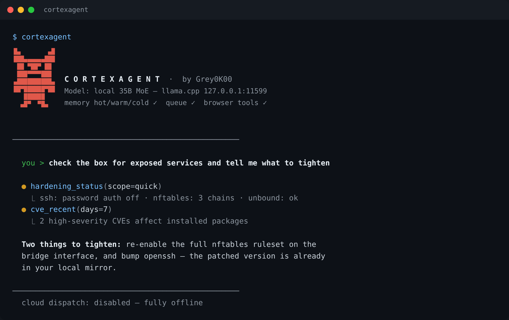
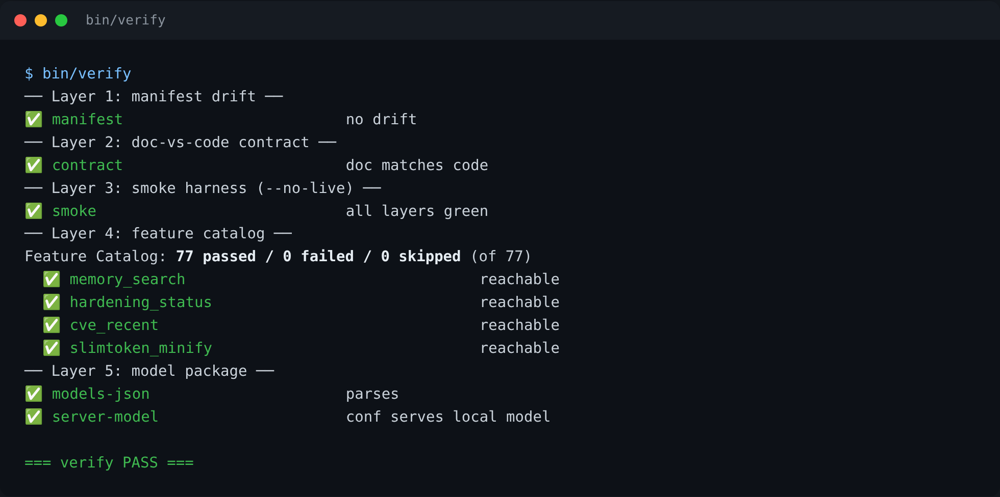
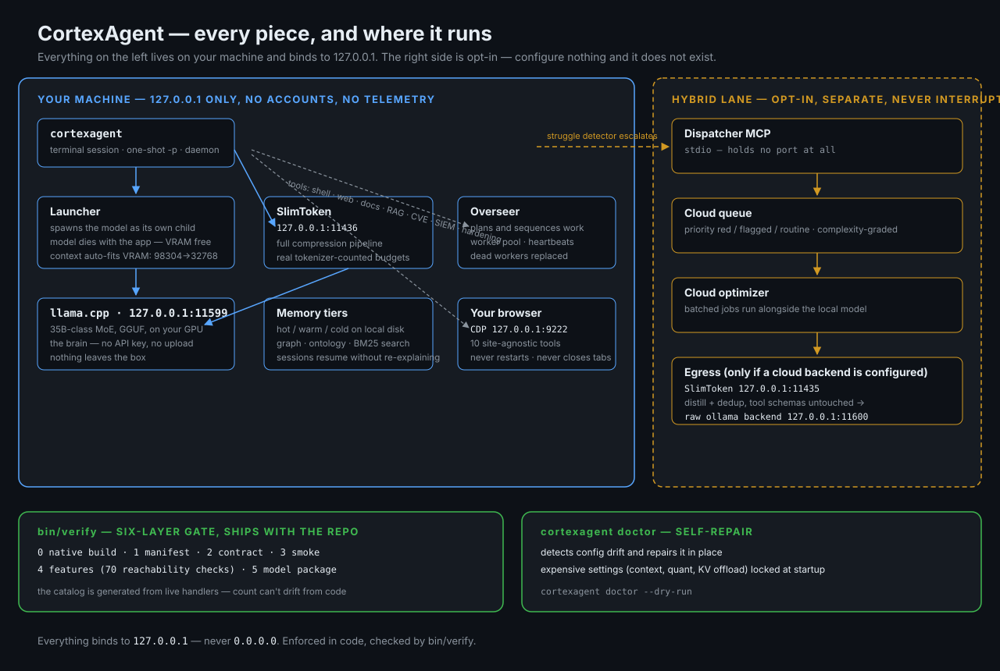
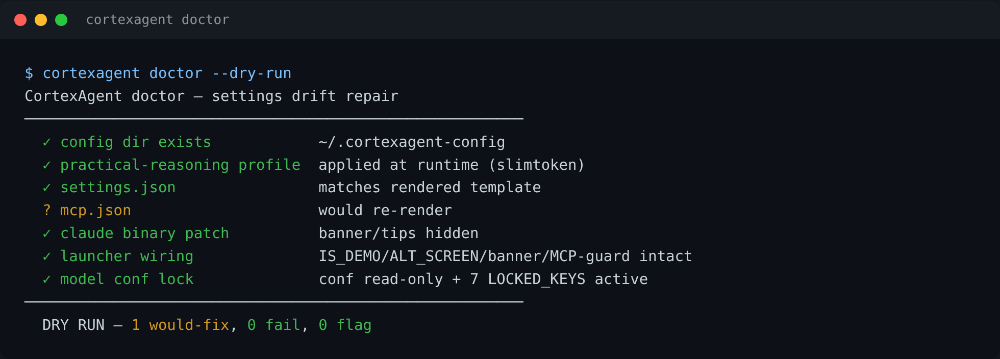

# CortexAgent

> **Your private, local AI coding agent — no cloud required, no API key.**



CortexAgent runs on your machine: a local llama.cpp model spawned and owned by the launcher, a terminal session pinned to it, automatic memory across sessions, local browser automation, and token compression in two profiles — a minimal coding one by default, and a lossy one for real-time conversation. Everything binds to `127.0.0.1`. No accounts, no telemetry.

Cloud is **optional and separate**: a hybrid lane built around one MCP server — a scheduler + cloud queue that takes work the local loop escalates. Don't configure it and cortexagent is fully offline; nothing cloud exists. See [The hybrid lane](#the-hybrid-lane) and [Security](#security).

---

## It verifies itself

`bin/verify` is an offline gate that ships with the repo — six layers, from native build state to the feature catalog. A release only ships when it passes, and you can run it yourself any time:

```bash
bin/verify
```



| Layer | Check |
|---|---|
| 0 · Native build | compiled Cython modules present and current |
| 1 · Manifest | file-hash drift across the repo |
| 2 · Contract | docstring/doc claims match code |
| 3 · Smoke | in-process smoke harness (no live endpoints) |
| 4 · Features | **70** feature-catalog reachability checks |
| 5 · Model package | models.json + local model conf |

The feature catalog is generated, not maintained: `tools/build_feature_catalog.py` re-derives it from the live handlers, so the count and the checks can't drift from the code.

---

## Install

Linux. An NVIDIA GPU with ~16 GB VRAM is recommended (CPU-only works, slower).

```bash
git clone https://github.com/greyok00/cortexagent
cd cortexagent
./install.sh     # config, memory dirs, systemd units, the `cortexagent` command
cortexagent      # first run starts your local model
```

`install.sh` is re-runnable and non-destructive — existing config is backed up, never silently overwritten.

---

## Start in 60 seconds

**Code with it** — open the session and give it a task:

```bash
cortexagent
# → "add a --dry-run flag to bin/publish and test it"
```

**One-shot, no session:**

```bash
cortexagent -p "find why the daemon is unresponsive and fix it"
```

**Drive the browser** — open two tabs in your debugging window (chromium by default) and pin them. The agent has ten site-agnostic CDP tools — navigate, click, type, snapshot, evaluate and more — it never restarts the browser, never touches the CDP port, never closes your tabs.

**Or let it answer your messages** — it watches one configured thread plus your inbox and replies from your default browser; your logged-in tabs are the credential. OAuth is an optional alternative, never a requirement.

---

## Features — the local half

Everything below works with zero cloud configuration. Every tool name is reachability-checked by `bin/verify` on every run.

### The agent

- **Terminal session pinned to the local model** — give it a task, watch it work, read what it changed.
- **Socratic mode** — an ambiguous request gets clarifying questions before tools run, not a guessed interpretation (`lib/react_loop.py`).
- **Overseer** — a background service that plans and sequences work: a worker pool with heartbeats, dead workers replaced automatically, published task progress.
- **Session awareness** — `session_broadcast` / `session_check` / `session_log` let parallel sessions see what the others are doing.

### The brain and its resources

- **Local model by default** — a 35B-class MoE on llama.cpp at `127.0.0.1:11599`, spawned by the launcher as its own child: context auto-fits your free VRAM (98304 → 73728 → 49152 → 32768 until it fits), and the model dies with the app — VRAM is back the same second.
- **Memory** — hot + cold tiers on local disk (uncapped hot working set, curated cold facts; a legacy `warm` mirror kept for older tooling), with a knowledge graph, ontology ops, and semantic (BM25) search: `memory_read`, `memory_write`, `memory_search`, `memory_clear`, `memory_search_semantic`, `memory_graph_query`, `memory_ontology`. Sessions resume without re-explaining yourself. A thin CLI (`memory_thin` — append/read/search/cold/sessions) plus `cortexagent_call` expose the same memory from scripts.
- **Token compression** — SlimToken minifies requests before the backend sees them: `slimtoken_minify` / `slimtoken_maxify` round-trip markers, a full pipeline on the local lane (`:11436`), tokenizer-counted budgets. More fits the window.
- **Self-repair** — `cortexagent doctor` detects and fixes config drift; see [Self-repair](#self-repair).

### The tool belt

| Group | What's in it |
|---|---|
| **Shell + delegation** | `run_command` (stdout/stderr, timeout-guarded), `query_llm` (overseer reasoning engine), `spawn_subagent` (full-tool-access subagent for parallel work) |
| **Browser** | ten CDP tools driving your own default browser: `chrome_status/tabs/navigate/fetch/click/type/evaluate/snapshot/fill_send/health` — site-agnostic, shadow-DOM aware, never restarts the browser |
| **Web + search** | `web_search` (local SearXNG → Firecrawl → DuckDuckGo fallback), the adapter layer with fan-out (`adapter_search`, `adapter_list` — Google CSE, SearXNG, …), `firecrawl_search` / `firecrawl_scrape` |
| **Documents + RAG** | `parse_document` (PDF/DOCX/PPTX/XLSX/scanned), `ingest_domain` (business/dfir/law/osint/programming), `rag_query`, `coding_practices`; plus the `cortexagent-rag-ingest` helper |
| **Security posture** | live read-only checks: `hardening_status`, `nftables_list`, `auditd_query`, `sshd_config_dump`, `sysctl_current`, `unbound_status`, `capabilities_list`, `lsm_stack` |
| **CVE + MITRE intel** | `cve_recent` (NVD+KEV+EPSS+GHSA+OSV cache), `cve_lookup` with ATT&CK technique mapping, `mitre_techniques_for_cve`, `mitre_mitigations_coverage`, `cve_poll_now`; CLI mirror in `bin/cortexagent-cve` |
| **SIEM + SOAR** | `siem_recent` / `siem_posture` / `siem_push_recent`, playbook runs over recent CVEs and posture fails (`soar_run_on_recent`, `soar_run_posture`), `soar_history`; CLI mirror in `bin/cortexagent-siem` |
| **Downloads** | `download` — parallel range-chunks, resumable (`.part` + HTTP Range), SHA256-verified |
| **Model providers** | `add_llm_provider` — checklist for adding a provider to the core |

### Safety rails

- **Injection guard** — prompt-injection markers detected and audited before they reach the loop.
- **Secret-leak ban** — outbound responses are scanned for API-key shapes (`sk-`, `ghp_`, …) and rejected.
- **Loop guard + pre-flight gates** — repeated failing calls are stopped; tools carry trust levels checked at the call site.
- **Config integrity** — expensive settings (context, quantization, KV offload) are **locked** at startup; `doctor` detects and repairs drift.

### Daemon and control

- **Persistent daemon** with a control socket — `ping`, `status`, `activity`, `run`, `start`, `stop`, `shutdown` — surfaced through `cortexagent status` and the status line.
- **Systemd units** for the daemon, overseer, and family services; `cortexagent --restart` bounces them and waits for health.

---

## Features — the hybrid half

Everything in this section is opt-in. Disable it and none of it exists — the agent is fully offline.

- **Message triage** — one configured thread plus your inbox, answered from your default browser; your logged-in tabs are the credential. Sends are deterministic — scripted payload steps with a post-send landing check, no model call in the loop, so a send can't loop, stall, or invent a recipient.
- **The hybrid lane** — queued, complexity-graded remote work that never interrupts the local model. Explained below, because it's one thing: [one MCP server](#the-hybrid-lane).

---

## The hybrid lane

The hybrid lane is a single piece: an MCP server that owns everything cloud. It's a stdio server — it holds no port at all.

### What it contains

| Tool | What it does |
|---|---|
| `queue_add` | queue a task — `priority: red\|flagged\|routine`, `complicated: true` routes it to cloud grading |
| `queue_next` | claim the next runnable task — refuses while something is already running (the anti-preempt contract) |
| `queue_list` | compact view of queued/running tasks |
| `queue_done` | mark a task done with a one-line result |
| `queue_block` | block a task that failed twice locally; surfaces it to you |
| `optimizer_status` | cloud optimizer state: last batch, latency, errors |

### How the local loop uses it

- **Escalation, not conversation.** When the local model keeps failing at the same call, the loop's struggle detector intervenes: it tells the agent to queue the task to the cloud lane (`complicated=true`, priority `flagged`) and stop repeating the failing call. The local session stays clean; the hard part runs in parallel.
- **Cloud work runs as a separate lane.** Queued jobs are graded for complexity, batched, and executed by the cloud optimizer — alongside the local model, never interrupting it. The two lanes claim work independently, so a busy brain never blocks a queued send.
- **Cloud traffic is minified on the way out.** Every cloud request passes through the local SlimToken cloud lane first (`:11435` — distill + dedup, tool schemas untouched) before reaching the raw backend (`:11600`).
- **With the dispatcher disabled, none of this exists.** No queue, no grading, no cloud calls — the session is pure local.

### The two SlimToken profiles

Everything local passes through SlimToken, which runs in one of **two profiles**.
The default is the minimal one, and it is the one you want for building.

| Profile | Set with | What it does | Use it for |
|---|---|---|---|
| **`code`** (default) | `SLIMTOKEN_MODE=code` | **No tool result is ever rewritten** — not an old one, not a new one — and every fenced code block reaches the model byte-for-byte. Only two things are removed: a duplicate tool result is stubbed (its bytes are still later in the conversation) and old assistant prose is shortened. Tool schemas are left exactly as written, so tool-calling is unaffected. | agent work — edits, tool calls, anything you will be held to |
| **`realtime`** | `SLIMTOKEN_MODE=realtime` | Gives up the newest turns to buy response speed: elides old user turns as well as assistant turns, cuts prose to 160 characters, shortens **even the newest tool result**. | talking — STT/TTS conversation, where nothing is being built |

Measured on SlimToken's shipped fixtures (`slimtoken modes --measure`): `code`
saves **73.1%** when the same file is read every turn, and **0.0%** on both a
session of distinct reads and a spoken conversation; `realtime` saves 85.3% and
59.5% on those two. Those zeros are why there are two profiles instead of one
setting — the minimal profile has no lossless lever left once nothing is
duplicated, and the profile that does have one spends evidence to get it.

**Choosing one.** `CORTEXAGENT_SLIMTOKEN_MODE` sets the profile for SlimToken
processes started *from* a session — the MCP tools, `slimtoken optimize`, the
Agent Skill — and an explicit `SLIMTOKEN_MODE` overrides it. The lane services
are separate systemd units with their own pins, so change those in the unit, not
in your shell. The compression panel reports the profile the serving process is
actually in, read from its own `/proc/<pid>/environ`, so it shows what is running
rather than what a config file claims.

---

## How it works



| Piece | Where | Role |
|---|---|---|
| Local model (llama.cpp) | `127.0.0.1:11599` | the agent's brain — spawned by the launcher, dies with it |
| SlimToken cloud lane | `127.0.0.1:11435` | minifies cloud-model requests (distill + dedup, tool schemas untouched) |
| SlimToken local lane | `127.0.0.1:11436` | full compression pipeline for everything else |
| Raw ollama backend | `127.0.0.1:11600` | optional cloud models — zero VRAM, used only if configured |
| CDP (the one browser) | `127.0.0.1:9223` | page-level browser automation — regular persistent chromium session |
| Hybrid lane (dispatcher) | stdio — no port | scheduler + cloud queue; only exists if you enable it |

Everything binds to `127.0.0.1` — never `0.0.0.0`. Enforced in code, checked by `bin/verify`.

> 💡 **VRAM:** the launcher owns the model lifecycle — close the app and VRAM is free the same second.
> ⚠️ **Model fit:** context steps down (98304 → 73728 → 49152 → 32768) until it fits the free VRAM; display load varies, so the fit varies with it.
> 🔒 **Localhost:** these ports are local-only by design — don't forward or expose them.

---

## How it compares

CortexAgent didn't start as an agent at all. It started as a session bridge — one unified session kept open across different coding agents instead of juggling separate ones. The bridge became a Claude wrapper, and when the wrapper's limits were hit, the core was replaced with **[pi.dev](https://github.com/badlogic/pi-mono)**, Mario Zechner's deliberately minimal coding agent — a bare model-and-tools loop you extend yourself. That minimalism is a real design position, and pi.dev's ancestry is visible in CortexAgent's core: the same small tool-loop shape, the same refusal to hide what the model is doing. But CortexAgent grew in the opposite direction. Instead of leaving the hard parts as exercises (packages you write for memory, compaction, supervision), it builds them in — and then verifies them, every run of `bin/verify`.

[Claude Code](https://claude.com/product/claude-code) is the strongest known implementation of this category, and the comparison against it is honest: it runs frontier models that no local GPU can match. But it is a cloud product — your code and context are sent to Anthropic's servers, billed per token, and unavailable offline. [ChatGPT](https://chatgpt.com) is a cloud assistant, not a coding agent on your machine: it can't hold a terminal session, edit your repo, or drive your browser. CortexAgent's bet is different: the loop doesn't need to be cloud-brained, but the *infrastructure around the loop* — compression, memory, supervision, self-verification — should be shipped, not improvised.

| | Claude Code (cloud) | ChatGPT (cloud) | pi.dev (minimal fork origin) | CortexAgent (local) |
|---|---|---|---|---|
| Model | Claude models, Anthropic's cloud | OpenAI's hosted GPT models | Any provider, incl. local | llama.cpp on your own GPU |
| Where your code goes | Anthropic's servers, per token | OpenAI's cloud, subscription | Depends on the provider you pick | Nowhere. No API key, no upload |
| Offline | No | No | Yes, with a local model | Yes |
| Runs code where | Your machine (CLI) — the model is cloud | OpenAI's sandbox — not your machine | Your machine, your tools | Your machine, your tools |
| Memory between sessions | `CLAUDE.md` files, maintained by hand | Server-side, stored by OpenAI | Bring-your-own | Hot/cold tiers, resurfaced automatically |
| Ambiguous request | The model guesses | The model guesses | The model guesses | Socratic mode: clarifying questions before tools run |
| Long-running work | The agent process | Not a terminal agent | The agent process | Overseer: worker pool, heartbeats, published progress |
| Config integrity | Anthropic's settings files | Consumer app settings | Env vars, trusted blindly | Expensive settings locked at startup; `doctor` repairs drift |
| Browser control | Bundled browser tools | Doesn't drive your browser | You wire it up | Drives the Chrome you already run over CDP — ten site-neutral commands, never restarts it, never closes your tabs |
| Release quality | Anthropic's CI | — | None | `bin/verify` — six-layer self-check gates every version |

**What the layers buy you in practice:** sessions that run long without falling off a context cliff, an assistant that remembers last week, ambiguous requests that surface their assumptions before spending your tokens, and settings that fail loudly instead of drifting quietly — with the trade-off stated plainly: a local model will sometimes be out-thought by a frontier one, and that is the price of everything staying on your machine.

---

## Built on

CortexAgent stands on tools other people built. Thanks and credit to the original authors:

- **[llama.cpp](https://github.com/ggml-org/llama.cpp)** by Georgi Gerganov and the ggml team — the model server that does the actual thinking.
- **[pi.dev](https://github.com/badlogic/pi-mono)** by Mario Zechner — the fork origin, and the cleanest argument for a minimal harness.
- **[Patchright](https://github.com/Kaliiiiiiiiii-Vinyzu/patchright)** by Vinyzu and Kaliiiiiiiiii — a stealth-patched Playwright used for hardened browser automation, alongside the raw [Chrome DevTools Protocol](https://chromedevtools.github.io/devtools-protocol/).
- **[orjson](https://github.com/ijl/orjson)** by Jim Crist-Harif, **[xxHash](https://github.com/Cyan4973/xxHash)** by Yann Collet, and **[tiktoken](https://github.com/openai/tiktoken)** by OpenAI — the fast JSON, hashing, and real-tokenizer layers inside SlimToken.

The compression proxy itself, **[SlimToken](https://github.com/greyok00/slimtoken)** (MIT), is CortexAgent's sibling project — a standalone token-optimization and memory layer usable with any LLM stack, not just this one.

---

## About the codebase

The source is deliberately dense. Most modules are written minified — tight one-line statements, no comments, no docstrings — because the *behavior* is the artifact: `bin/verify`'s layers (file integrity, documentation accuracy, a smoke-test harness, a feature-catalog sweep) check what the code does, not what the comments claim. If a check fails, the release fails.

The hot paths are compiled. `tools/build_opt.py` compiles hot lib modules (charts, coding_practices, cold_distiller, domain_db, token_tracker) to native libraries with **Cython**; a compiled module shadows its Python sibling and the import resolves to the native build automatically. If Cython or a compiler isn't available, the build skips gracefully and the pure-Python source takes over — nothing breaks either way. The compression pipeline itself is SlimToken, and its token math is real (`tiktoken`, with a bundled offline fallback), not estimated.

---

## When it's not for you

A tool that tests itself should name its own limits:

- **Frontier reasoning.** A local MoE is capable but not frontier-class. For a genuinely novel puzzle you'll often do better with a hosted model — and nothing here stops you from exporting a conversation and running it there.
- **It wants VRAM.** The launcher picks the largest context that fits your free VRAM automatically; forcing a bigger fit than the GPU holds OOMs — that's your experiment, so test it yourself.
- **Single-user, Linux-only.** One agent on one machine — not a multi-user team platform.

---

## Self-repair

```bash
cortexagent doctor --dry-run
```



Doctor detects config drift — rendered templates, MCP wiring, launcher integrity, model-conf locks — and repairs it in place. `--dry-run` shows what it would fix without touching anything.

---

## CLI

```bash
cortexagent                      # interactive session
cortexagent -p "task"            # one-shot
cortexagent --restart            # restart the background services
cortexagent status               # is everything up?
cortexagent queue list           # the prompt queue (also: clear/done/drop/context)
cortexagent doctor               # detect + fix config drift
cortexagent daemon start|stop|status|run
```

Companion CLIs: `cortexagent-cve` (`lookup`/`mitre`/`coverage`, registers the daily poll; module CLI adds `recent`), `cortexagent-siem`, `cortexagent-harden`, `cortexagent-rag-ingest`, `cortexagent-browser-health`.

---

## Security

- **Binds `127.0.0.1` only** — enforced in code, verified by `bin/verify`.
- **No API keys stored, no telemetry, nothing uploaded by default.** Cloud generation is opt-in: the hybrid lane is a separate stdio MCP server — disable it and cortexagent is fully offline; if you enable a cloud endpoint, requests are minified through the local proxy on the way out.
- **Browser-mode messaging stores no tokens** — your logged-in tabs are the credential. OAuth is an optional alternative for setups that prefer a token.
- **Outbound responses are scanned** for secret-shaped strings (API keys, tokens) before they reach you.
- **Local-first by construction** — memory and browser state live on your machine.

---

## License

MIT — see [LICENSE](LICENSE).

---

## Changelog

**v0.7.8 (2026-10-04)**

The status strip leads with your messages instead of a cloud/local readout, and the verify gate stops hardcoding one model name.

### Changed

- **The status strip shows your messages, not the cloud split.** `lib/cloud_state.py` counted `route == "cloud"` records in the dispatcher queue log and printed the split at the head of the strip; once that log went empty the segment sat on a stale "100% local" that never moved. It now leads with the messenger — the letter `M`, then how many texts and how many emails are waiting, counted per `channel` from `~/.config/messenger/unreplied.json` — in the slot the cloud readout held. The dispatcher `q{queued} r{running}` segment went with it: it read the status block with a regex for "queued"/"running" while the block writes "waiting"/"busy", so it rendered `q0 r0` no matter what the queue did.
- **`bin/verify` asks the conf which model it serves** instead of grepping for one fine-tune's name. The old check passed only for that one string and reported `cloud-only` for every other configured model, even a properly configured one. It now reads `[backend] model_path` from `~/.cortexagent/cortexagent.conf` and checks that the GGUF exists.
- **`DEFAULTS-NOTE.md` names a reference build rather than a fine-tune.** The local-model row now reads standard **Qwen3.6-35B-A3B** (MoE, 35B total / 3B active, 262k native) and says any GGUF the conf points at works.
- **Autocompact threshold raised 85 → 90** (`bin/cortexagent`), so a session compacts later and keeps more of the conversation intact.

### Fixed

- **`lib/stealth/worker.py` lost an unused parameter and a wrong comment.** `connect()` and `get_or_create_tab()` took `headless=True` and never read it — the CDP port and the user-data dir already decide where the window opens — so the parameter is gone. The stop-comment named Brave on `:9224` as the instance a broad `pkill` would hit; the real second debug instance is Firefox on `:9222`.

Verified with `bin/verify` (six-layer gate): PASS.

**v0.7.7 (2026-10-04)**

One browser on `:9223` sharing your real chromium profile, and a control-connection guard that no longer crashes on construction.

### Fixed

- **`browser_control.start_guard()` raised `TypeError` on every call.** It constructed `CDPGuard(port=9222, on_alert=None)`, but `CDPGuard.__init__` takes `bc` — the browser module it reads `CDP_HTTP` and `_ws_cache` from. Every caller died with `CDPGuard.__init__() got an unexpected keyword argument 'port'` (`lib/patchright_chrome_mcp.py:196`). It now passes `bc=sys.modules[__name__]`. Constructing is fixed; detecting is not — nothing in the tree ever populates `_ws_cache`, so the guard's poll loop still has no sockets to watch.
- **The stealth browser forced a virtual display.** `config/templates/cortexagent-stealth-chrome.service` pinned `Environment=DISPLAY=:99`, so the window opened on an Xvfb screen nobody could see even when a desktop was available. The template now takes `{{DISPLAY}}`, `install.sh` substitutes the real one, and `lib/stealth/worker.py` starts on the inherited `$DISPLAY`, falling back to Xvfb only when there is no real display.

### Changed

- **One CDP port, `:9223`.** The launcher, `bin/chromium-relaunch.sh`, `actions/open_url.py`, `lib/browser_control.py` and `lib/browser_cdp_guard.py` used or defaulted to `:9222` while `lib/stealth/worker.py` and `install.sh` used `:9223`, so the port a caller reached for depended on which file it read. Everything now agrees on `:9223`, and `assets/cortexagent-workflow.svg` shows it.
- **The one browser uses your real chromium profile.** `install.sh` defaulted the user-data dir to `~/.config/chrome-stealth-profile` — a profile with no cookies — so every automated visit was a signed-out session. It now defaults to `~/.config/chromium`, the profile holding your live logins, matching `launcher-config.json` (`user_data_dir`, `cdp_port: 9223`).
- **The launcher no longer forces Google Voice and Gmail open.** Session start dropped the hardcoded `https://voice.google.com/` + `https://mail.google.com/` pair, so an autostart no longer adds tabs nobody asked for. Pinned tabs are still opened by `bin/chromium-relaunch.sh` from `launcher-config.json`.
- **`bin/chromium-relaunch.sh` lost its stale second-window hint.** It advertised `chromium --remote-debugging-port=9225 --existing-profile-dir=…`, a port nothing listens on.

Verified with `bin/verify` (six-layer gate): PASS.

**v0.7.6 (2026-09-27)**

Four fixes and three additions, from one hunt into why the debugging browser kept multiplying.

### Fixed

- **The browser reopened on every session start.** The launcher's only guard was "is port 9222 already listening", so closing the browser simply meant the next session start reopened it, forever. It now records the boot id and opens its two tabs once per boot; a close inside the same boot is honoured. Force one open: `rm ~/.cortexagent/.browser-autostart`.
- **The browser ran on a second, empty profile.** It launched against `~/.cortexagent/chromium-cdp-profile` — no cookies, no history — so every automated visit was a signed-out session and every site asked for 2FA again. It now reads the same `launcher-config.json` as `bin/chromium-relaunch.sh`, so one profile holds your real logins.
- **Chromium rejected the control connection.** The launcher omitted `--remote-allow-origins=*`, which `bin/chromium-relaunch.sh` and `chromium-cw.service` both pass. Chromium logged `Rejected an incoming WebSocket connection from the http://127.0.0.1:9222 origin`, after which the Playwright path gave up for the rest of the session.
- **The compression panel named stages that were not running.** It read the stage flags from the serving process's environment with a default of `1` — correct before modes existed, wrong after, because a lane running `code` has `tools`, `system` and `messages` off with no variable set anywhere. It now resolves the mode from SlimToken's own mode table, not a copy, and reports the mode alongside the stages.
- **The compression panel presented a stale figure as current.** It now states the age of the number, where it came from, and whether a compressor is in the agent's path at all.
- **A newly connected feed client was replayed weeks of old events.** The cursor now starts at the end of the append-only log.

### Added

- **Browser autostart is opt-in.** `CORTEXAGENT_BROWSER_ENABLED` decides. With nothing set, a machine with no browser profile configured gets no launch and a one-line note saying how to enable it; a machine already set up behaves exactly as before.
- **`CORTEXAGENT_SLIMTOKEN_MODE`** selects the SlimToken mode for the SlimToken processes a session starts.
- **SlimToken's two modes are selectable and documented** — `code` (default) and `realtime`. See the [SlimToken v0.6.0 release](https://github.com/greyok00/slimtoken/releases/tag/v0.6.0).

### Changed

- **Route vocabulary is consistent.** Lanes are `local` / `cloud`; roles are `main` / `helper`. Applied in the notes and the installer.

**v0.7.5.1 (2026-09-26) — hotfix: TUI display.**

### Fixed

- **Tool output is expanded by default.** ctrl+o now starts ON and collapses on demand, instead of hiding tool results behind a collapsed one-liner. Assistant code blocks already displayed by default (owner directive 2026-09-23); the collapsed tool-output pane was what was hiding them.
- **The banner credits the author.** `greyok00` is the branding default instead of an empty string.
- **The TUI reports its real version** instead of a stale 0.7.3.x read from the shipped bundle.

**v0.7.5 (2026-09-26) — hotfix: memory tools.**

The in-TUI memory tools broke three ways at once. All three were reproduced first, then fixed.

### Fixed

- **`memory_read(limit=…)` threw.** The tool schema advertised a `limit` parameter the function never accepted, so every call carrying it died with a `TypeError`. It is now honored, default 20.
- **Hot reads were oversized.** They returned 50 full-transcript rows (~11.5k chars) straight into the model's context; they now return 20 rows of 400-char previews.
- **Multi-token search always returned `[]`.** The OR-fallback query bound its hit-count placeholders (in the `SELECT`) before the `profile` placeholder in the `WHERE`, so a LIKE pattern landed in the profile filter and nothing could match. Single-token queries still worked, which hid it. Placeholder binding now follows SQL text order. The same bug shipped in `memory/mcp_server.py` and is fixed there too.
- **Curated memory was invisible.** Search scanned only warm + hot for the agent's own profile; the cold tier — where curated facts live, including rules stored under the `shared` profile — was never consulted. Cold is now scanned first, its own ranked OR-fallback included, and cold reads span the shared, Claude and agent profiles.
- **A duplicate `memory_write` schema entry** was dropped from the registry.

**v0.7.4 (2026-09-26) — toolbelt: uncapped, wired, one researcher.**

### Changed

- **The react loop's hidden 16-tool cap is gone.** The model now sees its full registered toolbelt — 31 tools with the default configuration. `CORTEXAGENT_MAX_TOOLS` re-introduces a cap as an opt-in.
- **One researcher instead of fifty.** New `CORTEXAGENT_DISABLED_TOOLS` blocklist, honored by both tool listing and tool calls, retires the domain one-offs: `ingest_domain`, `rag_query`, `query_llm` self-calls, `download`, `add_llm_provider`, `coding_practices`, and the destructive `memory_clear`. Process-skills no longer register as model tools either.

### Fixed

- **MCP servers actually load now.** The launcher-generated `mcp.json` wrote each server as a single `command` string (`"python3 /path/to/x.py"`), which the client tried to execute as one filename, so every generated server (dispatcher, secops, messenger, …) silently failed to spawn. The config now emits `{command, args}` pairs, and the client splits legacy single-string entries for backward compatibility.
- **Memory injection is per-run again.** The hot recent-memory block is re-injected into the system prompt on every agent run — idempotent, last 40 entries — instead of once per TUI process, so resumed runs get their memory back.

### Added

- **RAG companion server** (`rag_mcp.py`) — FTS5/BM25 over the CortexLLM store (cold facts, wiki layer, coding practices), returning cited results with provenance and freshness, and an explicit no-match marker so the model cannot paper over a gap with an invented answer.

**v0.7.3.2 (2026-09-23) — hotfix: session memory amnesia.**

### Fixed

- **A resumed session had no memory of anything it did.** The bundled memory extension called the hot-memory API with swapped arguments (`append('user', prompt)` instead of `append(prompt, 'user')`) and passed a `platform` keyword that `read_last()` does not accept. Every write stored garbled rows and every read threw and was silently swallowed. The calls are fixed, legacy garbled rows are normalized on read, and memory failures now log instead of vanishing. The fixed extension ships in-repo as `extensions/memory.ts`.
- **Each run now records what it did.** Last tool names and the final output are written as an assistant row on `agent_end`, so resume sees actions, not just questions.
- **The compression panel read a dead path** (`~/.cortexagent/minify_stats.json`) and always showed "no data yet". It now reads SlimToken's live stats file (`~/.local/state/slimtoken/stats.json`), with the legacy path as fallback.
- **The dispatcher queue never pruned stale tasks.** Only done/block pruned and retention was 24h, so `blocked` tasks sat in the queue forever and froze the Tasks panel on an old list. The heartbeat now prunes every 60s, blocked tasks expire after 1h, and the panel lists 6 tasks.

**v0.7.3.1 (2026-09-23) — memory loop fix.**

### Fixed

- **The agent looped forever instead of working.** `memory_search` in the bundled memory MCP server (`memory/mcp_server.py`) matched the entire multi-word query as one exact substring (`LIKE '%whole query%'` in SQLite), so real queries returned `[]` every time and the agent kept re-asking memory, then grepping its own session logs in circles. Search is now per-token — AND across tokens, best-ranked first, OR fallback when the strict match is empty — and returns in under 0.1s. Verified end-to-end over the real MCP protocol.
- **The same whole-query substring bug** was fixed in the CortexLLM universal-memory server (`cortexllm_mcp_server.py`, deployed at `~/.config/cortexllm`), whose search never saw the `.jsonl` hot tier and required whole-query matches.

**v0.7.3 (2026-09-23) — full audit.**

A full-codebase audit pass, 60+ findings applied.

### Changed

- **Shrink — net −17.8k lines.** Dead code removed: tray, menu, `browser_pool`/`stable`, `model_switcher`, `tui_status`, `version.py`.
- **The cloud dispatcher is now an optional MCP server.** Disable it and CortexAgent is fully offline; all cloud functionality lives behind that one server.
- **Versions aligned to 0.7.3** across all workspaces and lockfiles.
- **README** gains a hybrid local/cloud section, a generic browser, optional OAuth, and a self-verify table.

### Security

- **PII purge** — zero personal identifiers in code, docs, images or config.

Verified with `bin/verify`: manifest, contract, smoke, feature catalog 77/77, model package.

**v0.7.2 (2026-09-10) — CLI routing fix.**

### Fixed

- **Subcommands dispatch again.** `cortexagent models status`, `cortexagent doctor`, `cortexagent queue list` and the rest of the control plane were falling through to the interactive agent and hanging. The entry point now routes every non-subcommand invocation straight through to the session launcher, and handles only the nine control-plane subcommands itself.
- **`run --list-models`** no longer silently drops the flag.

### Changed

- README gains a full command list: subcommands, session flags, and the `bin/` maintenance tools.

**v0.7.1 (2026-09-10) — bug-fix sweep.**

Fixes and docs only, no behavior changes.

### Fixed

- **Overseer state writes are atomic** — no torn state files on crash.
- Dead code from earlier refactors removed (simplify sweep across the repo).
- Perf fixes in hot paths.

### Changed

- **README rewritten for clarity**, and the project origin history corrected: it began as a unified session bridge across coding agents (Codex, Claude), became a Claude wrapper, then had its core replaced with pi.dev — it did not start as a fork of pi.dev.

Verified with `bin/verify` (four-layer self-check: PASS).

**v0.7.0 (2026-09-09) — CLI-only, one model.**

### Changed

- **One terminal window.** CortexAgent is CLI-only — the separate floating console is gone, and everything happens in a single command-line session.
- **One model.** The assistant runs a single large model stored on your machine. Smaller helper models and the image tools were removed, freeing memory and removing moving parts.
- **A cleaner README**, rewritten for non-technical readers, with a real screenshot of the command line.

No behavior change to privacy: everything still runs locally, with no cloud, no API key and nothing uploaded. This release passed the built-in automated self-check (`bin/verify`) before shipping.

**v0.6.0 (2026-08-24) — web UI removed.**

### Changed

- **Web UI removed** — the repository is code + README only; the terminal TUI and floating console remain.
- **All source minified**, with comments and docstrings stripped.
- **Native `.so` build via Cython by default**, with a graceful `.py` fallback.
- **Connection reuse and bytearray I/O** on hot paths.

### Security

- PII audited.

Verified with `bin/verify` (four-layer gate): 1,537 files with no drift, 84 feature checks, all green.
